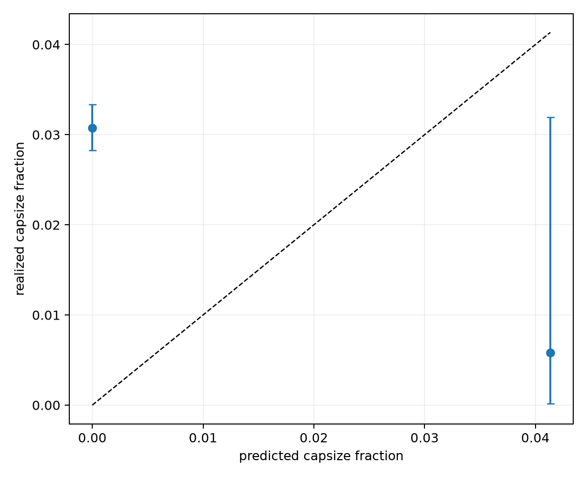
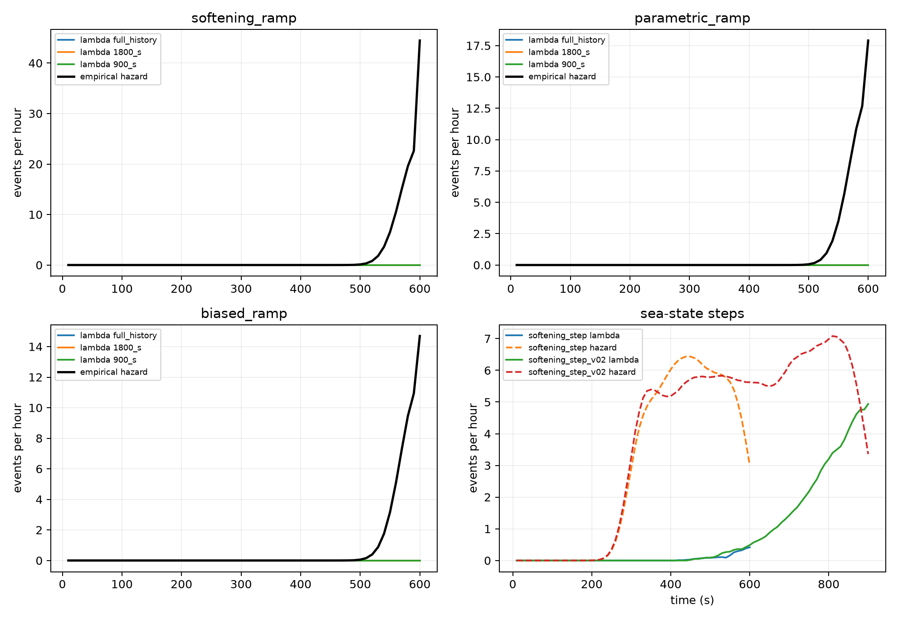
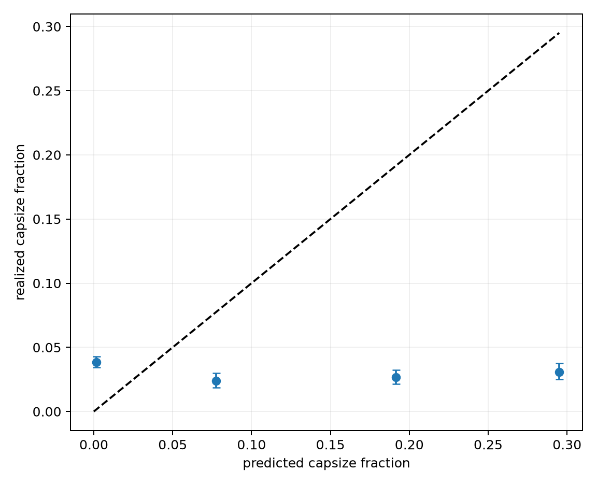
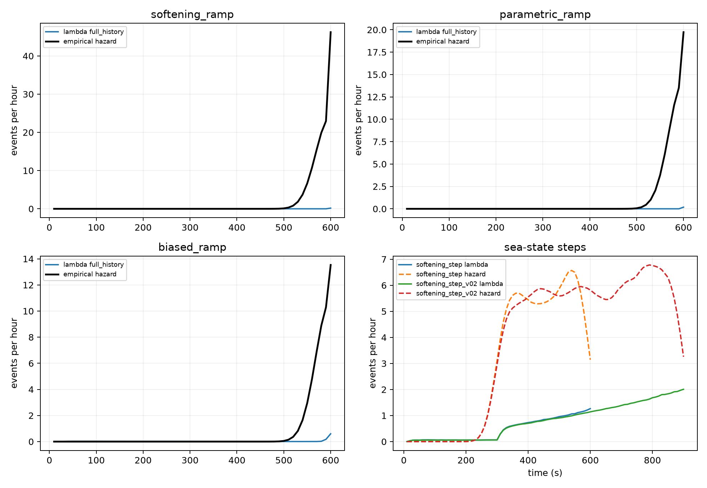
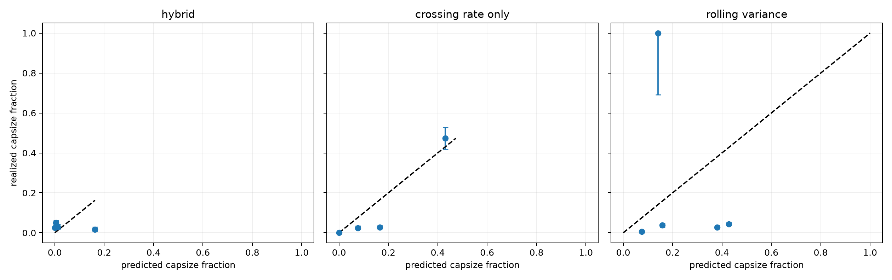

# Prototype #1 results — conformal and physics alarm layers

The JSON files under `results/` are the numeric record; PNG files are the figures. Unless stated
otherwise, brackets are two-sided 95% Clopper–Pearson intervals computed by the shared evaluation
harness. Sensitivity trials are capsize events in the detector's explicit debounce-and-horizon risk
set. False-episode intervals treat scorable
windows as alarm-opening opportunities, then rescale the probability interval by opportunities per
exposure hour. Debounce and refractory logic decluster episodes, but residual serial dependence
remains; full decorrelation-time intervals are deferred to Prototype #2.

Per-time E3/E3b coverage is computed over the surviving, non-capsized population. This conditioning
and the dependence among dense windows are not covered by marginal conformal guarantees, so their
narrow window-level intervals should not be read as trajectory-independent uncertainty.

## Post-audit methodology correction

An August 2026 audit found that the detector experiments had selected their nominal matched-
sensitivity operating points on the test curves. That made the reported test thresholds
retrospective. It also found inconsistent treatment of right-censored score windows and capsize
events that occurred before the common three-window debounce could possibly open an alarm.

The development experiments below were rerun after three corrections: controls and thresholds are
selected on calibration only and then frozen; supervised negatives require a complete forecast
horizon; and sensitivity includes only events for which the detector had enough scored endpoints
to open an alarm and at least one endpoint in the warning horizon. Test sensitivity can therefore
fall below the 90% calibration target. The two previously spent reserve evaluations were not rerun.
Their tables are retained as immutable historical records, but they do not validate the corrected
operating-point protocol.

Each regenerated development JSON carries SHA-256 fingerprints of the research source tree, the
tracked reference-campaign anchor, and its own serialized content. Downstream runners bind exact
upstream artifact digests, so the tables below cannot silently combine stale or mutated results.

## E1 — stationary coverage

Across 72 cells (three families, two horizons, three forecasters and four alpha values), mean
absolute coverage error was a descriptive **0.75 percentage points**. The worst cell was the linear
forecaster on the 60-second softening target at nominal 80%: coverage was **76.62% [73.83, 79.25]**,
a **−3.38-point delta [−6.17, −0.75]**. Exact intervals for every cell are in the JSON and the figure
retains binomial acceptance bands. This validates the implementation broadly but does not turn
marginal coverage into conditional or survivor-conditioned coverage.


## E2 — alarm operating cost and the physics floor

Controls were selected at the lowest calibration FPR attaining at least 90% sensitivity and then
evaluated once, unchanged, on the pooled 15,000-trajectory rare-event test set (60-second horizon):

| Method | Control | Sensitivity | False episodes / exposure h | Median lead |
|---|---:|---:|---:|---:|
| Envelope persistence | alpha=0.010 | 95.5% [91.63, 97.92] | 7.304 [7.179, 7.431] | 172.4 s |
| Linear quantile | alpha=0.020 | 85.0% [79.28, 89.65] | **6.383 [6.265, 6.502]** | 236.9 s |
| 4.6k-parameter JAX LSTM | alpha=0.020 | 96.5% [92.92, 98.58] | 6.963 [6.840, 7.087] | 179.5 s |
| Split-time danger margin | threshold=−1.10 rad/s | 82.0% [75.96, 87.06] | 8.228 [8.095, 8.362] | 137.9 s |

The danger-margin baseline fits a three-range local piecewise-linear restoring model separately on
each side: translate to the stable equilibrium, match its slope and the first smooth-restoring peak,
then force the repeller branch to vanish at the configured escape angle. The resulting repeller
slope enters Belenky et al.'s damped critical-rate formula (Eq. 13). At arbitrary scoring instants we
use the nearer intermediate threshold and extrapolate the separatrix line; the alarm score is
measured outward rate minus critical rate. Eq. 15's particular-solution correction is implemented,
but it is zero in E2 because wave-field inputs are prohibited.

The linear and danger-margin controls met the target on calibration but missed it on test; they are
not valid matched-sensitivity comparisons there. This quantity was developed as an offline
rare-event extrapolation metric. Our documented search
found no prior use as a continuously evaluated online alarm score; that novelty claim is therefore
provisional, not proof of absence. Here it is a useful physics floor, but at the ≥90% operating point
the fixed danger-margin control fails to retain 90% test sensitivity, so the earlier matched-cost
claim is withdrawn.

Exposure begins when a complete 120-second history makes the trajectory scorable. Every episode
overlapping a pre-capsize horizon is event-associated, so repeated alarms inside the horizon are not
charged as false. Exposure ends at the last horizon-complete scored endpoint, not at the later raw
record boundary. Lead time begins when the debounce-confirming window opens the earliest associated
episode and can exceed 60 seconds. The figure contains calibration curves plus the single frozen
test point for each method; test labels
were not used to publish or choose a test-set curve.


## E3 — scalar ACI through the sea-state transition

Nominal coverage was 90%. Correctly restricting “pre-step” to horizon-complete windows ending no
later than 240 seconds, fixed CQR covered **89.37% [89.06, 89.68]**. Windows ending at 250–290
seconds already contain post-step targets and covered only **17.68% [17.07, 18.30]**. Fixed CQR's
pooled post-step coverage was **0.74% [0.68, 0.81]**.

The calibration-selected scalar ACI setting remained gamma=0.05. With prediction outcomes fed back
only after the 60-second target is observable (six scoring steps), it covered **88.93%
[88.61, 89.24]** on horizon-complete pre-step windows and **82.44% [82.14, 82.74]** post-step, but
never held the trailing-60-second curve inside ±3 points. It produced **6.130 [5.861, 6.408]** false
episodes/hour versus **0 [0, 0.012]** for fixed CQR.

The frozen kill criterion therefore still triggers. This is a rolling/conditional demand;
Gibbs–Candès Proposition 4.1 guarantees long-run average error frequency, not rolling-window
coverage. The figure's large-gamma sawtooth is the scalar ACI limit cycle: a frozen score set drives
the working alpha into exterior levels to inflate bounds, which also inflates alarm episodes. The
precise finding is: **scalar ACI over a frozen score set cannot track this abrupt shift at the frozen
operational alarm cost**. It is not an indictment of every online adapter.


## E3b — DtACI and sliding score recalibration

E3b retained the same test bed and kill thresholds. Deterministic DtACI uses Gibbs and Candès'
published eight-expert gamma grid and target interval 500. Sliding ACI was selected only on the held
out calibration half from gamma `{0.001, 0.005, 0.01, 0.02, 0.05}` and score windows `{25, 50, 100}`;
the selected pair was gamma=0.05, window=25. Both adapters receive each outcome only after the
60-second forecast target becomes observable.

| Adapter | Post-step coverage | Recovery to ±3 points | False episodes / h | Verdict |
|---|---:|---:|---:|---|
| DtACI | 67.22% [66.85, 67.59] | not attained | 6.076 [5.808, 6.352] | kill |
| Sliding-score ACI | 87.18% [86.92, 87.44] | not attained | 5.863 [5.600, 6.134] | kill |

With realistic delayed feedback, recent-score recalibration no longer repairs the rolling-coverage
criterion, and neither successor stays under the predeclared alarm-cost threshold. Sliding
recalibration is explicitly nonexchangeable and does not inherit ordinary
split-conformal coverage; its motivation is recent weighting under distribution drift, not a claim
of exact exchangeable validity.


## E4 — cross-sea-state stress test

Training at Hs=4 m and deploying after the Hs=5 m step dropped raw nominal-95% LSTM snapshot
coverage to **69.48% [67.75, 71.17]**, a **25.52-point shortfall [23.83, 27.25]**. Deployment-
distribution calibration restored split-CQR snapshot coverage to **94.34% [93.43, 95.17]**, a
**−0.66-point delta [−1.57, 0.17]**. On dense post-step windows, fixed CQR covered **93.64%**
and delayed-feedback ACI covered **92.12%**.


# Prototype #2 results — deep motion-history warning

Prototype #2 uses 60-period, causally normalized roll/roll-rate windows, a 50-period event horizon,
the same three-window debounce/refractory policy for every method, and score-specific decorrelation
times estimated from calibration autocorrelation envelopes. Brackets remain 95% Clopper–Pearson
intervals. The numeric JSON is authoritative where a compact table omits secondary methods.
Operational score streams retain every causal pre-capsize endpoint so debounce has no
future-dependent gaps. Supervised comparisons, event risk sets, and exposure use the same final
horizon-complete endpoint for capsizing and noncapsizing records; later scores are inference-only.

The following criteria were frozen in `rahola_lab.constants` before development-test scoring:

1. Stop CNN iteration after the two-model grid if it cannot beat classical EWS when both retain the
   calibration-targeted ≥90% sensitivity in D1.
2. Apply the D3 bandwidth interpretation verbatim, whichever branch the data select.
3. Call the CNN an overall win only if it beats the danger-margin physics floor in D1 and is at
   least 10% lower-FPR than B1 in every held-out-family D2 rotation.

## D1 — within-distribution skill

The corrected 2,969-parameter CNN uses 12/24 channels, kernel 9, with no auxiliary family head.
Calibration selected variance trend over a 50%-window subwindow and neighbor radius 0.20. Each
method's threshold was selected on calibration and frozen before test scoring.

| Detector | Sensitivity | False episodes / exposure h | Lead q10 / median / q90 |
|---|---:|---:|---:|
| Temporal CNN | 92.36% [90.49, 93.97] | **15.548 [15.280, 15.819]** | 218.8 / 326.4 / 329.5 s |
| Classical EWS (variance trend) | 100% [99.61, 100] | 21.391 [21.079, 21.705] | 234.9 / 328.4 / 329.8 s |
| Galeazzi roll-power GLRT | 100% [99.61, 100] | 21.391 [21.079, 21.705] | 234.9 / 328.4 / 329.8 s |
| Split-time danger margin | 99.16% [98.36, 99.64] | 21.368 [21.057, 21.682] | 237.9 / 328.4 / 329.8 s |
| Story (2009) neighbor loss | 96.34% [94.94, 97.44] | 20.959 [20.651, 21.271] | 228.5 / 328.4 / 329.8 s |

The CNN preserves the calibration target on test and has the lowest false-episode rate. Its 27.3%
lower FPR/h than classical EWS comes with lower sensitivity (92.36% versus 100%); the
calibration-only operating-point comparison is a corrected development result, not prospective
holdout validation.


## D2 — family generalization

| Held-out family | CNN sensitivity | CNN FPR/h | B1 sensitivity | B1 FPR/h | CNN ≥10% better? |
|---|---:|---:|---:|---:|---:|
| Softening | 64.53% [60.01, 68.87] | 20.528 [20.000, 21.066] | 100% [99.21, 100] | 20.828 [20.296, 21.369] | No: CNN misses sensitivity |
| Parametric | 88.33% [83.58, 92.11] | 11.764 [11.361, 12.177] | 100% [98.47, 100] | 21.685 [21.145, 22.236] | No: CNN misses sensitivity |
| Biased | 76.21% [70.41, 81.37] | 3.533 [3.311, 3.766] | 100% [98.52, 100] | 21.657 [21.115, 22.208] | No: CNN misses sensitivity |

Each rotation selects every model and baseline control using only the two included families'
calibration split. After those controls and thresholds are frozen, the CNN misses 90% test
sensitivity in every held-out family. Its lower FPR in parametric and biased therefore cannot be
claimed as a matched operating-cost win. The model does not earn an all-family transferable
operating point. The full five-detector rotation
table, including calibration points and exact intervals, is in the JSON.

## D3 — skill versus forcing bandwidth

Severity was separately tuned to a 20–60% capsize band at every γ. JONSWAP γ=1 is the broadband
end; γ=15 and 30 are deliberately non-oceanographic narrow-band controls.

| γ | CNN sensitivity | CNN FPR/h [95% CI] | CNN AUC | B1 FPR/h [95% CI] | B1 AUC |
|---:|---:|---:|---:|---:|---:|
| 1.0 | 93.87% [90.68, 96.21] | **13.903 [12.846, 15.022]** | 0.920 | 15.213 [14.107, 16.378] | 0.350 |
| 3.3 | 87.62% [83.52, 91.00] | **13.655 [12.607, 14.765]** | 0.891 | 15.280 [14.173, 16.448] | 0.441 |
| 7.0 | 88.89% [85.01, 92.06] | **13.204 [12.173, 14.296]** | 0.871 | 15.055 [13.955, 16.215] | 0.468 |
| 15.0 | 93.97% [90.92, 96.23] | **13.745 [12.694, 14.858]** | 0.879 | 14.716 [13.629, 15.864] | 0.486 |
| 30.0 | 87.67% [83.85, 90.86] | **12.414 [11.414, 13.476]** | 0.862 | 14.332 [13.259, 15.467] | 0.534 |

The calibration-fixed EWS operating point is always-on through γ=15 and nearly always-on at γ=30;
its AUC carries the ranking story. The other baselines show related failures in the full JSON. Trend
statistics saturate because everything trends on a ramp; the danger margin's static restoring fit
goes stale as stiffness erodes; and causal normalization rescales growing amplitude away, erasing
the neighbor detector's novelty signal.

The CNN retains strong window ranking at every bandwidth, but it does not earn the predeclared
broadband operating-cost criterion: at γ=1 its 13.903 FPR/h is only 8.6% below EWS, short of the
10% materiality threshold. The two original verdict predicates were not complements, so the stored
verdict now takes an explicit inconclusive branch: ranking survives, but neither the material
operating-cost claim nor broadband collapse is established.


## D4 — wave-group stratification

A critical group is an evaluator-only run with instantaneous wave-height proxy
`2 × |Hilbert(elevation)| ≥ 0.75 Hs` for at least 1.5 peak periods. A capsize is group-preceded when
such a run overlaps its 200-second warning horizon. Across the unfiltered campaign record this
labels 1,202/1,241 capsizes, 96.86% [95.73, 97.76%]; the detector table then applies the corrected
common risk set. No forcing value enters a detector.

| Detector | Sensitivity: group (median lead) | Sensitivity: no group (median lead) | False episodes coincident with noncapsizing group |
|---|---:|---:|---:|
| CNN | 92.21% [90.29, 93.85] (326.3 s) | 96.88% [83.78, 99.92] (327.9 s) | 75.38% [74.61, 76.14] |
| Classical EWS | 100% [99.60, 100] (328.4 s) | 100% [89.11, 100] (328.6 s) | 88.40% [87.91, 88.88] |
| Galeazzi GLRT | 100% [99.60, 100] (328.4 s) | 100% [89.11, 100] (328.6 s) | 88.40% [87.91, 88.88] |
| Danger margin | 99.13% [98.30, 99.63] (328.4 s) | 100% [89.11, 100] (328.4 s) | 85.44% [84.90, 85.97] |
| Neighbor loss | 96.54% [95.15, 97.62] (328.4 s) | 90.63% [74.98, 98.02] (328.7 s) | 85.90% [85.36, 86.43] |

The corrected common risk set contains 924 group-preceded and only 32 non-group capsizes, hence
the wide latter intervals. Coincidence is tested against the actual alarm intervals within each
decorrelation-merged cluster, beginning only at the debounce-confirming window; quiet gaps inside a
cluster and the preceding candidate windows do not count as active alarms. Between 75% and 88% of
episodes charged as false coincide with a
noncapsizing critical-group encounter. This is a descriptive overlap only: groups are common, and
without a prevalence-matched null or encounter-identification test the coincidence does not show
that a detector identified the group or that the episode was operationally useful.

## D5 — within-regime discrimination

| Detector | Post-step window AUC | Fixed test sensitivity | Fixed test FPR/h [95% CI] |
|---|---:|---:|---:|
| CNN | 0.474 | 90.69% [88.73, 92.40] | **22.777 [21.747, 23.841]** |
| Classical EWS | 0.509 | 93.04% [91.30, 94.52] | 23.860 [22.806, 24.946] |
| Galeazzi GLRT | 0.493 | 90.98% [89.05, 92.67] | 23.041 [22.005, 24.110] |
| Danger margin | 0.499 | 91.67% [89.80, 93.29] | 23.411 [22.367, 24.488] |
| Neighbor loss | 0.498 | 91.08% [89.16, 92.76] | 23.675 [22.625, 24.757] |

No method discriminates imminent capsize well inside the harsh post-step regime. All methods can
attain the calibration target after impossible-to-observe events are removed from supervised model
fitting; operational score streams themselves remain causal and unfiltered by future outcomes. The
near-chance AUCs remain the substantive D5 result; achieving sensitivity requires alarm rates around
23–24 episodes/hour.

## Historical final reserve evaluation (immutable; superseded method)

The following is the original one-touch record. Its thresholds were chosen with the former
test-curve procedure and its risk sets predate the censoring correction. It is retained for audit
history and was not rerun; it is not a validation of the corrected development results above.

The guarded command accessed the reserve exactly once on frozen commit
`843b24a25437c5386208bc66ee0b79776ad207dc`, from 2026-08-03 05:07:08 to 05:09:20 UTC. It scored
18,000 trajectories (the same 5,000-evaluation/1,000-ramp mix per family as D1), yielding 1,213
observable capsizes and 1,781.47 exposure hours. Thresholds, model weights, and decorrelation times
were unchanged from D1.

| Detector | Reserve sensitivity | Reserve false episodes / h | Lead q10 / median / q90 |
|---|---:|---:|---:|
| Temporal CNN | 89.78% [87.93, 91.43] | **6.279 [6.164, 6.395]** | 277.8 / 328.6 / 358.4 s |
| Classical EWS | 91.67% [89.97, 93.17] | 9.232 [9.093, 9.372] | 197.3 / 357.9 / 360.1 s |
| Galeazzi roll-power GLRT | 89.53% [87.67, 91.20] | 8.295 [8.163, 8.428] | 171.3 / 309.3 / 358.5 s |
| Split-time danger margin | 94.72% [93.31, 95.91] | 9.103 [8.965, 9.242] | 29.3 / 329.4 / 359.8 s |
| Story (2009) neighbor loss | 98.35% [97.46, 98.99] | 9.306 [9.166, 9.447] | 273.3 / 358.8 / 360.3 s |

The CNN's FPR replicated D1 to within 0.01 episode/h, while sensitivity fell 0.69 points and just
missed 90%. This does not trigger model iteration: the final protocol prohibits retuning and reruns.
The completed, no-prior-access statement is in `results/final_reserve_attestation.json`; the command
now refuses a second invocation. This immutable historical attestation predates result-digest
binding.

## What the thesis rematch showed

### Deliberately acausal normalization appendix

On a disjoint held-out half of the calibration trajectories, thesis-style whole-record
normalization gives the neighbor detector **AUC 0.385** (3,066 windows; radius selected on the other
half). This diagnostic is deliberately acausal and is not an operational result. Here, restoring
the future-dependent normalization does not recover warning skill; it reverses the intended novelty
ranking, so strict causal hygiene is not what made the detector uncompetitive.

The 2009 neighbor-loss idea is sensitive but indiscriminate here. Its calibration-selected D1 point
catches 96.34% of risk-set capsizes, yet costs 20.959 false episodes/h, versus 15.548 for the CNN and
21.368 for the physics floor. It also has only 0.498 within-regime AUC and 89.99% of its nominally
false D1 episodes overlap noncapsizing critical wave groups. That overlap is descriptive and lacks
a prevalence-matched null. The core observation—new
phase-space regions precede extreme motion—survives, but neighbor count alone is not a competitive
alarm policy under a common operating-cost harness.

## Prototype #2 implementation judgments and deviations

- Story's Chapter 3 normalized each complete roll/pitch record by its mean and standard deviation,
  which uses future data. Rahola instead applies strict prior-only normalization to roll/rate. It
  replaces pitch with roll rate because the simulator is 1-DOF (Story 2009, Sec. 3.2.2, pp. 48–52,
  Figs. 38–41; Sec. 4.2.2, pp. 64–66).
- Chapter 3 set the binary warning at fewer than 50 neighbors and accumulated one flag per low-count
  sample. Rahola preserves score `−neighbor_count` and includes threshold −50 in the curve, but
  resolves persistence through the common three-window episode policy. Calibration selected radius
  0.20; one natural period is excluded so adjacent samples cannot count themselves.
- Chapter 4 searched the full history only on newly encountered roll regions, then reused the prior
  count. Rahola searches the exact trailing 60-period normalized phase plane at every score time;
  this preserves the novelty meaning but replaces the thesis's computational cache and pooled
  cross-run historical database. The thesis itself reports abandoning its real-time cumulative flag
  after corrupted output (Story 2009, pp. 65–67, Fig. 51).
- Galeazzi's W2-GLRT uses the transformed roll/pitch signal `d=roll²×pitch`. With no pitch and no
  permitted wave input, B2 applies the published fixed-shape scale-change likelihood ratio to
  natural-frequency-band roll, retaining the four-roll-period detection segment. It is a documented
  roll-power adaptation, not a literal reproduction of the multichannel statistic.
- B3 takes the dimensional roll/rate endpoint from the same causal window rather than its normalized
  representation; the closed-form danger margin requires physical units and remains unchanged.
- D4's 0.75 Hs/1.5 Tp Hilbert-envelope group is a stated run-length proxy inspired by critical wave
  groups, not Anastopoulos and Spyrou's full Markov-chain construction. Hilbert edge effects and the
  broad definition make groups common.
- Decorrelating alarm episodes merges gaps no longer than each calibration score's autocorrelation-
  envelope crossing time, following the Belenky-school convention. Clopper–Pearson FPR intervals
  still use scorable windows as the binomial opportunity convention; declustering reduces repeated
  episodes but does not make dense windows independent.
- Development test blocks were rerun while correcting the explicit thesis curve point and D4 risk-
  set denominator. The August audit later found that operating thresholds had nevertheless been
  selected from test curves; the corrected protocol and historical reserve limitation are recorded
  above.

# Prototype #3 results — restart comparisons and architectures

## What the restart comparison said

The corrected run used 16,000 test windows: 2,000 per campaign from the three stationary
evaluation campaigns, three ramps, and softening γ=1/3.3. Sampling uses capped-equal allocation
across each nonempty label × absolute-time-quartile stratum: small strata are exhausted and their
unused quota is redistributed. The AUC estimand is therefore a realized-sample design contrast,
not an exactly balanced population estimand.
Every method scored identical windows and labels. Confidence intervals use a 2,000-replicate
trajectory-block bootstrap.

These intervals condition on both the realized stratified sample and the realized restart draws.
They do not add uncertainty stages for unequal-probability sampling or rollout Monte Carlo error,
so they are neither design-based survey-sampling intervals nor full simulation-uncertainty bounds.

| Method | Design-balanced AUC [95% CI] |
|---|---:|
| C1 exact-state, independent-future restart | **0.8512 [0.8351, 0.8680]** |
| C2 filtered-state, independent-future restart | 0.4855 [0.4603, 0.5144] |
| Frozen D1 CNN | 0.6265 [0.5959, 0.6631] |
| B0 XGBoost engineered features | 0.7622 [0.7438, 0.7811] |
| Clock-only protocol quartile | 0.6565 [0.6436, 0.6706] |

No information-ceiling gate is valid. C1 and C2 draw fresh stochastic forcing and discard the
realized forcing phase encoded in the preceding motion history. C1 therefore need not upper-bound
a sequence model observing that history. The historical three-point gap trigger would open because
C1−CNN is 0.2246, but it is recorded only as the architecture decision that was made at the time,
not as proof of architecture headroom or an information limit.

The clock-only comparator exceeds both the CNN and C2 on this sampled estimand. Absolute protocol
time is therefore a material confound: the table cannot isolate motion/state information from the
campaign schedule, and CNN/C2 rankings must not be attributed to motion history alone.

C1 knows exact endpoint roll/rate, true current stiffness, deterministic remaining ramp, family,
and sea-state specification. C2 is a known-family, Rao–Blackwellized bootstrap filter: exact
observed roll/rate are pinned while 2,000 particles infer stiffness and linear drift under a robust
encounter-innovation likelihood. The optional family-marginalized PF was not run. C1−C2 is 0.3657,
C2−CNN is −0.1410, and C1−CNN is 0.2246, but these are restart-comparator gaps rather than a
clean decomposition of state-estimation and model-capacity error.

Probability calibration is reported separately with post-stratum weights that reconstruct the
source-window population. C1's weighted Brier score is 0.00721 and weighted ten-bin ECE is 0.00078;
those numbers are not calibration of the capped-equal AUC sample. The final regenerated program took
1,950.5 seconds (32.5 minutes), below the two-hour budget, with 200 restarts per window and no
coverage reduction.

## B1 — amortized physical filter

The selected 4,329-parameter gray-box uses a temporal encoder, Gaussian physical-latent head, and
split-time-inspired outward-rate margin hazard. Auxiliary weight 0.25 beat 1.0 on calibration.

| Test | Gray-box FPR/h | CNN FPR/h | Relative change |
|---|---:|---:|---:|
| D1 pooled | 17.471 [17.188, 17.757] | 15.548 [15.280, 15.819] | 12.4% worse |
| D2 held-out softening | 18.615 [18.111, 19.130] | 20.528 [20.000, 21.066] | 9.3% lower; sensitivity 10.9% |
| D2 held-out parametric | 11.265 [10.871, 11.670] | 11.764 [11.361, 12.177] | 4.2% lower; sensitivity 87.9% |
| D2 held-out biased | 5.124 [4.856, 5.402] | 3.533 [3.311, 3.766] | 45.0% worse; sensitivity 77.0% |

One required kill fires after calibration-only threshold selection. The other two verbatim gates
are not evaluable without conditioning on test outcomes or survival:

- **“Kill: fails to beat the from-scratch CNN's D2 FPR/h by >=15% in at least two of three
  rotations.”** B1 earned 0/3.
- **“Kill: worse than the CNN by more than its CI width at matched sensitivity.”** Not evaluated.
  D1 gray-box FPR/h is 17.471 versus 15.548 for the CNN, but their frozen test sensitivities differ;
  matching them on test would reopen test-label selection. The former 16.086 comparison remains a
  calibration-targeted diagnostic, not the verbatim kill.
- **“Kill: mean absolute stiffness error exceeds 10% over the final third of the ramp.”** Not
  evaluable unconditionally because trajectories capsizing before the final third have no such
  outcome. The survivor-conditioned, trajectory-weighted diagnostic MAE is 0.420 across 1,996
  trajectories and exceeds the 0.10 limit.


## B2 — Chronos transfer probe

The probe pins `amazon/chronos-t5-tiny` revision
`29d808298f1a62493e7b9a5e08529d0d930fa189` (8.39M parameters, Apache-2.0) and tries exactly two
modes: frozen encoder embeddings with a linear head, and a one-epoch full-encoder fine-tune with a
head. CPU cost forced an explicit 128-trajectory-per-campaign subset; all B2 test comparators use
those same trajectories. Fine-tuning is capped at 1,024 class-weighted windows. The artifact records
the actual samples per rotation: 97–116 positives and 908–927 negatives; these are not described as
balanced.

| Held-out family | From-scratch CNN: sens; FPR/h | Chronos frozen: sens; FPR/h | Chronos fine-tuned: sens; FPR/h | Twenty-capsize CNN: sens; FPR/h |
|---|---:|---:|---:|---:|
| softening | 100%; **17.113 [14.836, 19.626]** | 92.3%; 18.083 [15.743, 20.658] | 90.4%; 18.259 [15.908, 20.845] | 100%; 16.583 [14.342, 19.063] |
| parametric | 100%; 12.960 [10.979, 15.185] | 100%; **10.844 [9.035, 12.901]** | 100%; 20.190 [17.720, 22.892] | 100%; 11.197 [9.358, 13.283] |
| biased | 86.2%; **9.588 [7.883, 11.543]** | 96.6%; 18.376 [16.010, 20.978] | 96.6%; 20.152 [17.676, 22.861] | 86.2%; 8.966 [7.319, 10.865] |

The B2 kill does **not** fire: frozen Chronos qualifies on held-out parametric with 16.3% lower
FPR/h while both methods detect every evaluable event. Softening Chronos is worse, and the biased
from-scratch CNN misses the sensitivity target, so those rotations do not qualify. The corrected
development probe therefore has one qualifying rotation and a development survivor. This
cannot alter or retrospectively validate the already-spent reserve-2 evaluation.
The Twenty-Capsize protocol used all normal trajectories from the target stationary training
campaign plus exactly 20 target capsizes and earns no additional transfer result.

D5 remains the negative control: frozen-embedding AUC is 0.500 and fine-tuned AUC is 0.570 after
right-censored tails and the ambiguity buffer are removed. Their orientation-independent AUCs are
0.500 and 0.570, respectively, so neither crosses the 0.58 leakage-audit trigger.

## Historical final reserve-2 evaluation (immutable; invalid operating-point selection)

This one-touch result is retained exactly as produced, but the audit found that Chronos selected
its threshold by sweeping reserve-2 outcomes. The 50.5% FPR reduction below is descriptive, not a
prospective operating-policy validation. Reserve-2 is spent and was not rerun.

B2's survivor triggered the guarded run exactly once on commit
`5d4c6be78ba87e1a042f99825909c37d38bbd702`, from 2026-08-03 15:41:53 to 15:48:14 UTC. The
holdout contains 128 trajectories from each of the six D1-mirroring campaigns: 768 trajectories,
129 observable capsizes, and 76.25 exposure hours. Every method below uses that same holdout.

| Detector | Sensitivity [95% CI] | False episodes/h [95% CI] | Lead q10 / median / q90 |
|---|---:|---:|---:|
| Chronos frozen embedding | 93.80% [88.15, 97.28] | **3.292 [2.899, 3.723]** | 45.6 / 129.5 / 357.8 s |
| Chronos fine-tuned | 91.47% [85.25, 95.67] | 7.134 [6.553, 7.753] | 178.6 / 299.3 / 359.7 s |
| Frozen D1 CNN | 97.67% [93.35, 99.52] | 6.649 [6.088, 7.248] | 280.1 / 330.1 / 357.8 s |
| Split-time physics floor | 97.67% [93.35, 99.52] | 7.882 [7.270, 8.530] | 29.4 / 339.9 / 359.9 s |

Under the invalid retrospective threshold choice, the frozen Chronos embedding head has 50.5%
lower FPR/h than the CNN, with sensitivity 3.9 points lower. That cannot support the former claim
that it replicated as the operational winner. Fine-tuning is worse than the CNN on pooled
reserve-2. The completed attestation is
`results/final_reserve2_attestation.json`; repository-local guards refuse a repeat under the stated
procedure. This immutable historical attestation also predates result-digest binding.

## Prototype #3 implementation judgments and deviations

- The restart API accepts per-trajectory roll, rate, current stiffness, stiffness drift, and
  deterministic-parametric phase offset. Independent restart variance differs from a corresponding
  full-run segment by 3.1%, inside the predeclared 15%; capsize fraction differs by zero points.
  That direct equivalence test covers stationary softening only; parametric, biased, and ramped
  restart equivalence remain unvalidated.
- C2 pins essentially noise-free synthetic roll/rate observations and filters only stiffness and
  drift. It assimilates every two seconds so band-limited forcing innovations are not treated as
  independent samples. No family-marginalized variant was run.
- B0 is XGBoost 3.3.0 with a fixed 200-tree, depth-3 configuration. Its features are variance, AC1,
  two Kendall trends, envelope summaries, period, danger margin, neighbor count, GLRT, and endpoint
  magnitudes.
- B1's “posterior” is a diagonal Gaussian latent head; its analytic hazard uses the posterior mean.
  This is an amortized approximation, not the 2,000-particle C2 posterior or an MC physics rollout.
- B2 uses univariate Chronos passes for roll and roll-rate, concatenating their encoder summaries.
  The CPU subsample is a declared deviation from full D2 coverage. B1 values shown beside B2 in the
  JSON use full D2 and are therefore contextual, not exact paired-subset comparisons.
- Historical B1 attempts exposed empty pre-window trajectories and non-finite sentinel thresholds.
  The audit removed synthetic sentinel observations entirely; empty score streams are now valid and
  every operational threshold is finite.

## Relation to prior work

Our documented search found no conformal-prediction application to motion-based ship-stability or
capsize early warning. Nearby maritime uses concern AIS trajectory and collision regions, including
a recent conformal collision-boundary study. The established motion-based false-alarm benchmark is
Galeazzi et al.'s parametric-roll monitoring: Weibull/phase signal tests, designed false-alarm
discipline, and year-long full-scale validation. Rahola is a ROM-first synthetic step toward adding
distribution-free uncertainty to that operational standard, not a replacement for its sea trials.

The 1-DOF approach follows the field's ROM-first methodology: Belenky et al. explicitly describe
1-DOF models as guides for multiple-DOF numerical methods. The caveat is substantive. Stability
variation in waves and stern-quartering roll/rate dependence require body-nonlinear models with at
least heave, roll, and pitch; this library cannot validate those effects.

## Reproduce

```bash
uv run python examples/e1_coverage.py
uv run python examples/e2_operating_curve.py
uv run python examples/e3_transition.py
uv run python examples/e3b_adapters.py
uv run python examples/e4_stress_test.py
uv run python examples/d1_detectors.py
uv run python examples/d2_family_generalization.py
uv run python examples/d3_bandwidth.py
uv run python examples/d4_wave_groups.py
uv run python examples/d5_within_regime.py
uv run python examples/p3_acausal_neighbor.py
uv run python examples/p3_ceiling.py
uv run python examples/p3_b1_graybox.py
uv run python examples/p3_b2_chronos.py
```

`uv run rahola-lab final-eval` is deliberately absent from the reproducible command list: it is a
one-time protocol, and the completed reserve-2 attestation makes a repeat procedurally forbidden.

## Frozen judgment calls and deviations

- The alarm angle is 0.60× the relevant escape angle; episode debounce and refractory are three
  10-second scoring windows. All episodes overlapping the event horizon are excluded from false
  counts; this recommended choice lowers re-alarming penalties relative to the original E3 report.
- False-episode confidence intervals use scorable windows as binomial opportunities. This satisfies
  the requested common Clopper–Pearson calculation but is only an interval convention under serial
  dependence, which is stated rather than hidden.
- The danger statistic uses the nearer side's threshold and an instantaneous separatrix
  extrapolation between exact upcrossings. The forced correction is zero because E2 is motion-only.
- The initial physics threshold grid ended at −1.0 rad/s and failed to include its analytic always-on
  endpoint. Before final scoring it was extended to −1.75 using fitted config values only; no test
  labels selected the endpoint.
- For asymmetric biased runs, maximum-absolute-roll targets use the smaller escape magnitude in both
  directions. This is conservative but can score a positive excursion against the negative margin.
- DtACI uses deterministic Algorithm 2 rather than randomized Algorithm 1. Sliding ACI tunes only on
  the held-out calibration half and carries no exchangeable finite-sample claim.
- CQR calibration retains one independent snapshot per calibration trajectory. Dense windows are
  operational units, not independent conformal units. Per-time E3 curves also condition on survival.
- Pure JAX is the only neural runtime through Prototype #2. Prototype #3 adds PyTorch solely for the
  pinned Chronos B2 experiment. E2 reports the operational 60-second horizon; E1 covers both frozen
  horizons.
- Provisional earlier work accessed original test splits more than once while correcting risk sets,
  initialization, and threshold provenance. Corrected controls now use calibration only, but the
  literal test-touched-once process rule remains unmet and no fresh-offset holdout remains.

## Method references

- Story, [Predicting Ship Capsize Using Lyapunov Exponents](https://vtechworks.lib.vt.edu/items/7eee36dd-055b-4aec-b49d-b173c2232278),
  Virginia Tech M.S. thesis (2009), especially Secs. 3.2.2, 3.3, and 4.2.2–4.3.
- Dakos et al., [Methods for Detecting Early Warnings of Critical Transitions in Time Series](https://dash.harvard.edu/handle/1/9637972),
  *PLoS ONE* 7 (2012), rolling variance/AC1 and Kendall trend.
- Bury et al., [Deep learning for early warning signals of tipping points](https://pubmed.ncbi.nlm.nih.gov/34544867/),
  *PNAS* 118 (2021), compact sequence-model comparison.
- Galeazzi, Blanke & Poulsen, [Early Detection of Parametric Roll Resonance on Container Ships](https://backend.orbit.dtu.dk/ws/files/7633739/Early_Detection.pdf),
  IEEE CDC (2012), W2-GLRT Eqs. 37 and 42 and the four-period segment.
- Belenky et al., [Estimation of probability of capsizing with split-time method](https://sandlab.mit.edu/wp-content/uploads/24_OEJ.pdf),
  *Ocean Engineering* 292 (2024) 116452, especially Eqs. 11–15 and 26–36.
- Anastopoulos & Spyrou, [Ship dynamic stability assessment based on realistic wave groups](https://doi.org/10.1016/j.oceaneng.2016.10.042),
  *Ocean Engineering* 134 (2017), critical-wave-group motivation.
- Romano, Patterson & Candès, [Conformalized Quantile Regression](https://arxiv.org/abs/1905.03222)
  (2019), one-sided upper-tail Theorem 2.
- Gibbs & Candès, [Adaptive Conformal Inference Under Distribution Shift](https://arxiv.org/abs/2106.00170)
  (2021), equation (2) and Proposition 4.1.
- Gibbs & Candès, [Conformal Inference for Online Prediction with Arbitrary Distribution Shifts](https://jmlr.org/papers/v25/22-1218.html)
  (2024 journal version; 2022 preprint), deterministic DtACI Algorithm 2.
- Foygel Barber et al., [Conformal Prediction Beyond Exchangeability](https://projecteuclid.org/journals/annals-of-statistics/volume-51/issue-2/Conformal-prediction-beyond-exchangeability/10.1214/23-AOS2276.full),
  *Annals of Statistics* 51 (2023), recent weighting under drift.
- Galeazzi et al., [Parametric roll resonance monitoring using signal-based detection](https://orbit.dtu.dk/en/publications/parametric-roll-resonance-monitoring-using-signal-based-detection/),
  *Ocean Engineering* 109 (2015), 355–371.
- Alba et al., [Enhancing Maritime Safety](https://www.mdpi.com/1424-8220/25/5/1365),
  *Sensors* 25 (2025), AIS collision boundaries with conformal prediction regions.
- Ansari et al., [Chronos: Learning the Language of Time Series](https://openreview.net/forum?id=gerNCVqqtR),
  *Transactions on Machine Learning Research* (2024), frozen time-series foundation model.

# Experiment U1 addendum — online split-time rate estimator

## 2026-08-04 predeclarations

These commitments were recorded before any U1 test-block read. Calibration selects one common
configuration by maximizing the number of calibration campaigns whose 95% predicted-count
interval captures the realized count, then minimizing reliability error, then following the
listed grid order. Reliability error is the bin-count-weighted mean absolute difference between
predicted and realized rates. Five calibration-quantile bins define the reliability edges; those
edges remain fixed on test data.

1. The primary intermediate threshold is the fitted, side-specific GZ-maximum angle. A
   campaign-adaptive level targeting 7–10 declustered crossings per 30 minutes appears once as a
   sensitivity analysis.
2. Positive and negative crossings are pooled after normalization by
   `u = outward roll rate / side-specific critical outward roll rate`. Per-side results appear once
   as a diagnostic.
3. Declustering follows Belenky et al. (2024), Section 4.3. The roll-autocorrelation envelope joins
   the absolute local extrema and ends a cluster only when no subsequent crossing lies within one
   decorrelation time of the preceding crossing. The largest `u` in each cluster is retained. The
   envelope threshold is 0.05.
4. Calibration sweeps tail quantile `q` over `{0.50, 0.75}`, Gamma-prior strength `a0` over
   `{2, 5, 10}` pseudo-exceedances, and trailing history over `{full history, 1,800 s, 900 s}`.
   Calibration freezes all controls before test scoring. On records shorter than a candidate
   window, the available causal history is used; candidates that coincide because of record
   length remain separate reported rows. If the empirical quantile reaches or exceeds the critical
   level, `w` is clipped to the largest representable value below 1 and the emission is flagged.
   An emission starts only after its available full causal history contains three tail
   exceedances; earlier exposure contributes zero predicted events.
5. U1a succeeds when 95% predicted-count intervals capture the realized count in at least five of
   the six stationary and rare-event evaluation campaigns.
6. U1c expects the estimated rate to rank vulnerability comparably to the danger margin and to
   remain near chance on D5's geometry. Any D5 AUC above 0.58 triggers a leakage audit, not a
   positive interpretation.
7. The U1d kill fires unless the full decomposition beats both rolling variance and declustered
   upcrossing rate alone on campaign-level CI captures and on the bin-count-weighted mean absolute
   reliability error. If it fires, tuning stops and the negative result stands.
8. With 600-second records and a 300-second step, no fully post-step trailing window of 30 minutes
   exists; U1b reports transient tracking only and makes no established-regime claim. The existing
   900-second `softening_step_v02` campaign will be reported separately for its fully post-step
   segment.
9. The estimator emits every 10 seconds. Its 95% interval uses 512 vectorized parametric-bootstrap
   draws with seed 20,260,804. The bootstrap is recomputed every 60 seconds and carried forward to
   the intervening 10-second emissions. Window statistics use the existing 1,000-replicate,
   campaign-stratified trajectory-block bootstrap with seed 20,260,804. Predicted counts use a
   causal left-rectangle integral: each emission applies until the next emission or exposure end;
   exposure before the first valid emission contributes zero.

The reliability diagram converts each trajectory's integrated rate to capsize probability with
`1 - exp(-integrated rate)`. U1b smooths capsize times with a Gaussian kernel whose standard
deviation is 7.5 configured natural periods. Tracking lag maximizes mean-centered cross-correlation
over ±30 natural periods; positive lag means the estimator trails the empirical hazard. Bias is
the mean estimated rate minus mean empirical hazard on their common grid. Step settling requires
the ensemble estimate to enter and remain within 10% of the post-step hazard. U1c uses D1's
calibration-selected 90%-sensitivity target, three-window debounce and refractory rules, 50-period
outcome horizon, and five-period ambiguity buffer.

The primary estimator is a known-configuration method: it observes dimensional roll and roll rate
and uses the configured restoring model, but no wave, encounter, future-forcing, or reserve-block
information. The implementation follows the paper's ROM decomposition and exponential-tail
argument. It does not implement the Motion Perturbation Method from Sections 3.2–3.5, because that
method resimulates future waves and falls outside online operation.

## 2026-08-04 results

Calibration selected `q = 0.75`, prior strength `a0 = 10`, and full causal history. The 900- and
1,800-second candidates coincide with full history on the 600-second U1a records. This choice
exposes the experiment's central failure: the three-exceedance rule requires at least 12 retained
crossings at `q = 0.75`, so four test campaigns emitted no rate at all and the two softening
campaigns emitted only sparsely. The selection rule was followed as written; no post-test repair or
alternative control was substituted.

### U1a — CI capture and reliability

The headline criterion failed with **0 of 6** campaign-level captures, against the predeclared
target of at least 5. The pooled reliability diagram's bin-count-weighted mean absolute error was
0.030784. That modest pooled number is not evidence of calibration: low average event prevalence
allows a near-zero predictor to score well while missing every campaign count.

| Test campaign | Realized capsizes | Predicted count [95% interval] | Valid emissions | Capture |
| --- | ---: | ---: | ---: | :---: |
| softening stationary | 95 | 5.590 [4.704, 6.697] | 584 | no |
| softening evaluation | 95 | 1.859 [1.457, 2.410] | 364 | no |
| parametric stationary | 79 | 0.000 [0.000, 0.000] | 0 | no |
| parametric evaluation | 50 | 0.000 [0.000, 0.000] | 0 | no |
| biased stationary | 138 | 0.000 [0.000, 0.000] | 0 | no |
| biased evaluation | 92 | 0.000 [0.000, 0.000] | 0 | no |

The terminal retained-crossing side diagnostic was balanced where emissions existed: 664 positive
and 635 negative crossings for softening stationary, and 459 positive and 465 negative crossings
for softening evaluation. The other campaigns had no terminal retained sample under the frozen
tail rule. The adaptive-threshold sensitivity hit 8.703 and 8.481 declustered crossings per 30
minutes in the two softening campaigns, but reached only 0.441–5.184 in the other four and produced
zero valid predicted counts everywhere. It therefore does not rescue the primary result.

The diagnostic GPD fit, never used in `lambda_hat`, had shape -0.1034 and scale 0.1651 above
`w = 0.7730` from 3,590 calibration exceedances. On softening-stationary calibration data, the
paper-style component composition gave a predicted-count interval [294.270, 387.958], versus
[6.744, 9.134] from U1's primary parametric bootstrap. The 91.298-count width difference is
secondary to the much larger location disagreement, which reflects different pooled-component and
online-emission constructions.



### U1b — nonstationary tracking

All three 600-second ramp records are shorter than every finite candidate window, so the reported
rows coincide. The numerical lag is 0 seconds for full history, 900 seconds, and 1,800 seconds in
each family, but the estimator path is flat at zero and the lag is **not estimable**. The meaningful
statistics are the negative biases: -2.092/h for softening (95% trajectory-bootstrap interval
[-2.266, -1.931]), -1.042/h for parametric [-1.156, -0.920], and -0.899/h for biased
[-1.010, -0.792].

For the 600-second sea-state step, the cross-correlation optimizer reached its +120-second search
boundary and settling was never attained; bias was -2.834/h [-2.996, -2.674]. The 900-second v0.2
step likewise never settled, reached a +120-second point lag with interval [50, 120] seconds, and
had bias -3.096/h [-3.283, -2.905]. The longer campaign supplies a fully post-step segment, but it
does not supply a successful established-regime estimate.

With 600-second records and a 300-second step, no fully post-step trailing window of 30 minutes
exists; U1b reports transient tracking only and makes no established-regime claim.



### U1c — detector framing

U1c is unevaluable. Its one permitted test read reached the trajectory-block alarm interval, where
all bootstrap replicates were non-finite under the sparse frozen score stream. The harness raised
`bootstrap statistic produced no finite replicates`; no operating point, D1 AUC, D5 AUC, or 0.58
leakage verdict was recorded. The implementation now serializes this sparse case explicitly, but
the test blocks were not reread. This is a process failure, not a near-chance result.

### U1d — baselines and kill

U1d completed its numerical pass but failed before durable publication because a NumPy boolean in
the result payload was not JSON serializable. The implementation now converts NumPy booleans, but
the spent test blocks were not reread and the in-memory comparisons were not reconstructed.
Therefore the kill is **unevaluable**, not passed or failed.

The predeclared text was: “If the full decomposition does not outperform both rolling variance and
declustered upcrossing rate alone on campaign-level CI captures and on the bin-count-weighted mean
absolute reliability error, then the split-time decomposition adds nothing online beyond its
components — report that negative as the result and stop tuning.” U1a's zero captures are strongly
negative evidence, but they do not supply the missing baseline comparison required to fire this
specific kill.

### U1e — causal period fusion

The single U1e variant estimated the equilibrium-upcrossing period from causal history, formed
`kappa_hat = (T_n / T_hat)^2`, and recomputed the piecewise critical growth rate at each detected
crossing. Both fixed and adaptive variants emitted zero rates on all ramp tests. Their tracking-lag
deltas were 0 seconds because both paths were flat; these are not estimable tracking improvements.
Both variants captured 0 of 3 ramp counts and had reliability error 0.334667, so the capture delta
and reliability-error delta were both zero.

### Interpretation and information set

Belenky and Weems' roll/rate independence assumptions are cleanest in beam seas. Rahola is a
beam-seas benchmark by construction, so U1 tests this estimator where that theory is strongest.
The negative result cannot be assigned to stern-quartering dependence or stability variation in
waves.

`lambda_hat` is a known-configuration estimator. It consumes dimensional roll and roll rate and
uses the true configured restoring model for the GZ-maximum levels and critical rates. It receives
no sea state, wave field, encounter information, protocol clock, or realized future forcing. U1e
is the first limited step toward estimating one configured quantity from motion. The estimator
makes no claim about event timing; its intended claim was calibrated conditional rate estimation,
and U1a rejected that claim under the frozen controls. All rates and intervals remain conditional
on the calibration-selected controls.

| Method | Motion history | Vessel configuration | Wave or encounter input | Claimed output |
| --- | :---: | :---: | :---: | --- |
| `lambda_hat` U1 primary | yes, causal | yes, true restoring model | no | conditional capsize rate with interval |
| `lambda_hat` U1e | yes, causal | yes, except online stiffness multiplier | no | ramp sensitivity diagnostic |
| H1 hybrid | yes, causal | yes, true restoring model plus offline design-stage calibration | no | offline conditional × onboard crossing rate plus observability intercept |

### Departures and judgments

- Sections 3.2–3.5: U1 uses the ROM closed-form critical rate and omits the Motion Perturbation
  Method, future wave replay, and 3-/6-DOF engineering-fidelity simulation. Those methods are not
  online under U1's information set.
- Section 4.3: the brief's phrase “previously retained crossing” was clarified using the paper's
  chainwise cluster construction: consecutive crossings extend a cluster, and its maximum is
  retained.
- Section 4.7: U1 replaces the paper's goodness-of-fit or prediction-error tail-threshold selection
  with the predeclared empirical quantiles and adds a Gamma-rate prior for small-sample shrinkage.
  Thresholds at or above normalized severity 1 are clipped below 1 and flagged.
- Section 5.2: the primary interval uses the predeclared Poisson/binomial/Gamma parametric bootstrap
  rather than component-boundary composition. The calibration-only comparison above reports the
  difference once.
- The reliability probability is `1 - exp(-integrated rate)`; missing pre-emission exposure
  contributes zero; integration is causal left-rectangle; interval draws update every 60 seconds
  and carry across intervening 10-second emissions.
- U1b uses a Gaussian hazard kernel of 7.5 configured natural periods, searches lag over ±30
  periods, and defines 10% sustained agreement as settling. A flat estimator makes lag
  unidentifiable even when the optimizer returns a numeric boundary or zero.
- U1d's rolling-variance baseline averages causal rolling variances per trajectory before applying
  the calibration-fitted isotonic map. Its failed artifact means this judgment produced no result.
- U1e uses positive-going crossings of the fitted equilibrium to estimate period and does not tune
  or clip `kappa_hat`.

### Reproduce

The successful artifacts were produced from committed runner `9091b7a`; sparse-result hardening was
committed afterward without test reruns.

```bash
uv run python -m rahola_lab.experiments.u1a
uv run python -m rahola_lab.experiments.u1b
uv run python -m rahola_lab.experiments.u1c
uv run python -m rahola_lab.experiments.u1d
uv run python -m rahola_lab.experiments.u1e
```

U1a, U1b, and U1e produced `_u1` artifacts. U1c and U1d produced provenance-bound failure
artifacts after their test reads were spent. No reserve or reserve-2 block was read. No historical
result artifact, `docs/paper/` file, or `docs/rahola-explainer.html` was modified.

# Experiment U1-r2 addendum — emission-policy repair

This addendum supersedes only r1's muzzled-emission mechanics and conclusions that depended on
them. The r1 predeclarations, executions, artifacts, and failure record remain unchanged history.
All diagnostics and control selection below used calibration blocks only.

## Phase A — calibration diagnosis

The crossing structure supports a family-scope distinction. Parametric capsizes almost always
follow the first retained crossing on that side, leaving little history for tail estimation.
Softening stationary and evaluation trajectories more often revisit the intermediate level.

| Calibration campaign | Median retained crossings/trajectory | Terminal crossing is first on side | Median first-crossing-to-capsize |
| --- | ---: | ---: | ---: |
| softening stationary | 6 | 40/71 (56.34%) | 0.926 s |
| softening evaluation | 5 | 15/25 (60.00%) | 0.824 s |
| softening ramp | 1 | 234/234 (100.00%) | 3.249 s |
| softening step | 2 | 249/368 (67.66%) | 0.798 s |
| softening step v0.2 | 4 | 328/620 (52.90%) | 57.272 s |
| parametric stationary | 1 | 84/87 (96.55%) | 0.761 s |
| parametric evaluation | 0 | 7/7 (100.00%) | 0.771 s |
| parametric ramp | 1 | 147/147 (100.00%) | 2.465 s |
| biased stationary | 2 | 91/119 (76.47%) | 0.476 s |
| biased evaluation | 1 | 19/20 (95.00%) | 0.417 s |
| biased ramp | 1 | 124/126 (98.41%) | 5.390 s |

Three biased-stationary capsizes had no retained crossing. Full distributions and denominators are
in `results/u1_phase_a_u1r2.json`.

The softening-stationary calibration attribution table is the following frozen Phase-A record.
`Magnitude` is the absolute change from the nominal exponential critical-crossing baseline;
`residual` is predicted minus the 71 realized capsizes.

| Cause | Direction | Magnitude | Predicted count | Residual |
| --- | --- | ---: | ---: | ---: |
| baseline: nominal-declustered exponential critical crossings | none | 0.000000 | 339.744966 | 268.744966 |
| event versus crossing accounting: absorbing transform | down | 60.650039 | 279.094927 | 208.094927 |
| tail form: empirical terminal-crossing probability | down | 271.714953 | 68.030014 | -2.969986 |
| tail form: diagnostic GPD under absorbing accounting | down | 46.341308 | 293.403659 | 222.403659 |
| Eq. 15 motion-derived forced correction | up | 2062.255034 | 2402.000000 | 2331.000000 |
| declustering: 0.5x decorrelation time | up | 43.412764 | 383.157730 | 312.157730 |
| declustering: 1.5x decorrelation time | down | 16.028964 | 323.716003 | 252.716003 |

The empirical terminal-crossing probability was 0.011901 (71/5,966). The r1-selected exponential
model estimated 0.056947; the diagnostic GPD estimated 0.060583. The motion-derived Eq. 15 variant
estimated 0.402615 and therefore moved sharply away from ground truth.

The r1 gate covered 1.3118% of softening-stationary exposure and 0.1079% of
softening-evaluation exposure. It covered zero exposure in all four parametric and biased
campaigns. On the covered slices it predicted 7.733 versus one realized softening-stationary
capsize and 0.226 versus zero softening-evaluation capsizes.

## Phase B and Phase C predeclarations

The following choices are frozen before any U1-r2 TEST trajectory is materialized:

1. The three-exceedance validity gate is removed. The estimator emits at the first sample. Pooled
   family calibration fixes `w`, `P(u > w)`, and the Gamma-rate prior; emissions with fewer than
   three observed exceedances carry `prior_dominated` but remain in every integral. A zero-crossing
   point rate is zero and carries a Garwood Poisson upper interval. Campaign bootstrap draws retain
   the observed-count Poisson construction, avoiding one independent pseudo-count per trajectory.
2. Campaign counts use `sum(1 - exp(-integrated rate_i))`. On calibration, absorbing accounting
   reduced the nominal softening prediction by 60.650039 counts, or 17.8516%; this is material on a
   71-event headline scale.
3. Eq. 13 without forced correction remains primary. Its absolute probability error from the
   empirical terminal-crossing rate was 0.045046, versus 0.390714 for the motion-derived Eq. 15
   diagnostic. The Eq. 15 row remains a known-configuration sensitivity only.
4. Full causal history is fixed. The repaired calibration sweep selected `q = 0.75` and `a0 = 5`
   by the r1 ordering rule: one of six campaign intervals captured, and reliability MAE was
   0.116994. No trailing-window sweep remains.
5. Named scope claim: “The decomposition yields calibrated counts on softening-type campaigns; on
   parametric and biased campaigns its prior-dominated estimate is expected to remain
   uninformative, and that scope limit — if observed — is the finding.” U1a-r2 reports the unchanged
   pooled 5-of-6 criterion and two campaigns per family.
6. U1a-r2 succeeds only with at least five of six 95% campaign-count captures. U1c-r2 retains the
   D1 calibration-selected 90%-sensitivity operating point, trajectory-block AUC intervals, and the
   D5 orientation-independent AUC >0.58 leakage-audit trigger.
7. The U1d-r2 kill text remains: “If the full decomposition does not outperform both rolling
   variance and declustered upcrossing rate alone on campaign-level CI captures and on the
   bin-count-weighted mean absolute reliability error, then the split-time decomposition adds
   nothing online beyond its components — report that negative as the result and stop tuning.”
8. With 600-second records and a 300-second step, no fully post-step trailing window of 30 minutes
   exists; U1b-r2 reports transient tracking only. The 900-second v0.2 step supplies the separate
   fully post-step segment.
9. The r1 cadence, 512-draw parametric bootstrap, seed, reliability bins, hazard kernel, lag search,
   settling rule, adaptive-threshold sensitivity, and causal left-rectangle integration remain
   unchanged unless item 1 or 2 explicitly replaces them.

The predeclared fresh TEST offsets are recorded in `DATA.md`. U1-r2 will use only those ordinary
TEST slices; neither reserve block is eligible.

## Phase C — fresh one-shot results

All five runners completed once against the anchored `_u1r2` TEST campaigns. No runner was retried,
and no control was changed after commit `ce5c37f`.

### U1a-r2 — repaired emission policy

The repaired estimator captured **0 of 6** campaign counts, below the unchanged 5-of-6 success
criterion. It captured 0 of 2 campaigns in each of the softening, parametric, and biased families;
the named softening-scope claim therefore failed. The pooled bin-count-weighted reliability MAE
was 0.103151.

| Fresh TEST campaign | Predicted capsizes | 95% interval | Realized | Captured |
| --- | ---: | ---: | ---: | :---: |
| softening stationary | 249.349 | [214.704, 223.780] | 82 | no |
| softening evaluation | 1,129.075 | [997.158, 1,017.603] | 111 | no |
| parametric stationary | 20.320 | [17.250, 19.553] | 96 | no |
| parametric evaluation | 23.400 | [20.304, 22.409] | 46 | no |
| biased stationary | 132.675 | [118.350, 124.984] | 144 | no |
| biased evaluation | 267.126 | [243.058, 252.970] | 105 | no |

The adaptive-threshold sensitivity also captured 0 of 6. Its predicted counts were 302.243 and
804.612 for the two softening campaigns, 22.408 and 10.736 for parametric, and 149.177 and 179.812
for biased. The prior-from-start repair did remove the r1 emission muzzle: every campaign emitted
from the first sample. It did not repair the count calibration. All parametric-evaluation and
biased-evaluation emissions were `prior_dominated`; even softening retained predominantly flagged
emissions (55,388/58,386 stationary and 298,632/301,765 evaluation).

The point estimate can lie outside the reported parametric interval because the frozen interval
resamples observed crossing counts while the point retains the posterior mean. This inherited
construction was not repaired after TEST access; it does not affect the zero-capture verdict.



### U1b-r2 — tracking and steps

All three ramp estimates reached the +120-second lag-search boundary. Their biases were -2.142/h
for softening, -1.120/h for parametric, and -0.815/h for biased. Count predictions were 0.001,
0.000, and 2.198 against 497, 295, and 223 realized capsizes, respectively.

The 600-second step had a 40-second lag, -2.420/h bias, and predicted 160.121 versus 1,169
capsizes. The 900-second v0.2 step had a 60-second lag, -3.099/h bias, and predicted 312.248 versus
1,888. Neither step settled within the predeclared tolerance, and neither count interval captured.



### U1c-r2 — detector framing

The calibration-selected threshold was the lower finite floating-point sentinel
`-1.7976931348623157e+308`, reflecting the zero-heavy calibration score stream. On fresh D1-like
evaluation/ramp data, sensitivity was 1.000 for 30 observable capsizes, false episodes were
22.584/h, and raw AUC was **0.309821** with trajectory-block interval [0.307920, 0.311682]. The
orientation-independent value is 0.690179; this inversion is descriptive and was not a
predeclared D1 pass rule.

D5 was **unevaluable** because the fully post-step endpoint slice contained only one class. Its AUC
and orientation-independent AUC are null, so the predeclared orientation-independent AUC >0.58
leakage audit has no Boolean verdict. This is an explicit sparse/one-class result, not a rerun or a
near-chance substitution.

### U1d-r2 — frozen kill fires

The full decomposition had 0 campaign captures and reliability MAE 0.103151. Rolling variance had
0 captures and MAE 0.191410; declustered upcrossing rate alone had 1 capture and MAE 0.059882.
Tail factor alone, reported as an additional component diagnostic, had 0 captures and MAE 0.090146.
The full method did not strictly beat both required baselines on both metrics. **The kill fired.**

The frozen verdict is: “If the full decomposition does not outperform both rolling variance and
declustered upcrossing rate alone on campaign-level CI captures and on the bin-count-weighted mean
absolute reliability error, then the split-time decomposition adds nothing online beyond its
components — report that negative as the result and stop tuning.”

No post-kill tuning was performed.

### U1e-r2 — causal period fusion

Fixed and adaptive critical-rate variants each captured 0 of 3 ramp counts. Their reliability MAEs
were 0.337600 and 0.337596, giving an adaptive-minus-fixed delta of **-0.00000475** and a capture
delta of **0**. Tracking-lag deltas were 0 seconds in all three families; both variants returned the
+120-second search boundary. Bias deltas were 0.000/h for softening and parametric and +0.000117/h
for biased. The fusion produced no material rescue.

## U1-r2 interpretation and departures

The emission-policy diagnosis was correct but insufficient. Removing the three-exceedance gate
made the estimator continuously available; fresh data show that its exponential critical-crossing
probability and rate composition remain badly miscalibrated. The predeclared family-scope claim
also failed: softening did not separate from the prior-dominated families on count capture.

- Sections 3.2–3.5: as in r1, U1-r2 uses the ROM Eq. 13 unforced critical rate and omits the Motion
  Perturbation Method, future wave replay, and higher-fidelity engineering simulation. The
  calibration Eq. 15 diagnostic moved farther from the empirical terminal-crossing probability.
- Sections 4.3–4.6: the paper's crossing and chainwise declustering mechanics remain unchanged.
  U1-r2's `prior_from_start` emissions are an online-availability policy layered on those mechanics,
  not a paper claim.
- Section 4.7: U1-r2 fixes pooled family `w`, `P(u > w)`, and a Gamma exponential-rate prior from
  calibration instead of selecting a tail threshold by goodness of fit or prediction error on each
  available sample. Emissions with fewer than three exceedances are retained and flagged.
- Section 5.2: campaign counts use absorbing first-event probabilities
  `sum(1 - exp(-integrated rate_i))`, a Garwood zero-count upper bound, and the frozen
  observed-count parametric bootstrap rather than composing the paper's component boundaries.
- U1c applies an event-detector operating curve to the online rate; that AUC framing and its 0.58
  D5 leakage trigger are Rahola diagnostics, not results claimed by the paper.
- U1e's causal equilibrium-upcrossing period multiplier is a single motion-only sensitivity and is
  not the paper's Eq. 15 forced correction.

The `_u1r2` artifacts and `results/provenance_manifest_u1r2.json` bind the five one-shot outputs to
the source digest, all three reference anchors, and exact U1a upstream dependencies. Neither
reserve block was read. No r1 artifact, paper draft, or explainer was modified.

# Experiment H1 addendum — hybrid offline conditional × onboard crossing rate

H1 extends the U1 record and supersedes nothing. U1-r2's online-tail kill stands. H1 tests only
whether an offline design-stage conditional transfers when the onboard estimator supplies the
measured declustered crossing rate.

## 2026-08-04 predeclarations

All design work and offline fitting use train and calibration blocks. No H1 TEST trajectory exists
at this point in history.

### C1 — terminal partition and storage observability

The chainwise cluster and decorrelation rules remain those of U1 and Belenky et al. Section 4.3.
A capsize is **heralded** when it occurs before the next retained crossing on either side and within
one decorrelation time of the cluster's last raw crossing. That retained cluster alone receives a
terminal label. Every other capsize is **unheralded**. The two channels must be exhaustive and
exclusive; the implementation asserts the partition.

This amendment follows a fit-data diagnostic. Biased-stationary train contained 12 unheralded
capsizes, and calibration contained 6. All 18 occurred on the weak negative side. In every case,
the last valid 2-Hz sample remained inside the side's GZ-max threshold and capsize followed 0.3 or
0.4 seconds later, within one 0.5-second output interval. Ten train and three calibration cases had
no recorded cluster; the other five retained only a stale cluster outside one decorrelation time.
This exact signature identifies an absorbing-storage observability gap.

No crossing or severity is fabricated. The decorrelation condition remains unchanged. H1 fits the
crossing conditional from the observed clusters and heralded terminal labels. Separately, it fits
the family-specific offline intercept `lambda_0` as unheralded capsizes per exposure hour, with a
95% Garwood Poisson interval, from the same data as each conditional variant.

### C2 — offline conditionals

For each family, H1 fits `P(terminal | crossing, u)` as a monotone-nondecreasing isotonic curve.
Ten equal-frequency severity bins, with duplicate edges merged, define the fit and 95% Wilson
bands. Weighted pool-adjacent-violators fits the bin proportions and their lower and upper bands.
The variants form a fixed hierarchy:

1. **Primary:** stationary train plus stationary calibration only. This is the hard severity-
   transfer claim and the only variant eligible for the headline verdicts.
2. **Secondary:** primary data plus rare-event evaluation calibration. This is a pooled-severity
   sensitivity.
3. **Tertiary:** secondary data plus one causal motion covariate. Trailing 30-minute roll RMS at the
   retained crossing is split at family-specific fit-data terciles, and one isotonic curve is fit
   per tercile. Records shorter than 30 minutes use all available causal history.

The conditional contains no online tail estimate.

### C3 — hybrid rate and uncertainty

The onboard estimate is

`lambda_hat(t) = sum_j P_hat_offline(terminal | u_j) / exposure(t) + lambda_0`,

where `j` spans the full-causal-history retained clusters available at `t`; rates are converted to
events per hour. This equals declustered crossing rate times the retained crossings' mean offline
conditional, plus the offline observability intercept. It emits from `t=0` every 10 seconds and
uses the r2 causal left-rectangle and absorbing-event accounting
`sum_i(1 - exp(-integrated lambda_i))`.

Every 60 seconds, 512 parametric draws with seed 20,260,804 draw Poisson counts for each observed
conditional bin. A split-normal draw whose 2.5% and 97.5% points match that bin's Wilson limits
supplies the conditional probability. The same construction composes the offline intercept's
Garwood limits. Draws carry forward between interval updates. This is a fixed numerical
composition of measured-count and offline-fit uncertainty, not an online tail model.

### C4 — comparators and reliability

The primary hybrid is compared with two per-family isotonic maps fitted on the primary's stationary
train+calibration diet: declustered full-history crossing rate to realized capsize rate, and mean
causal full-history rolling variance to realized capsize rate. The rate-only map directly absorbs
unheralded events; it receives no separate intercept. Comparator campaign intervals use the frozen
1,000-replicate trajectory bootstrap. All methods use absorbing-event count contributions.

Five equal-frequency rate bins fitted separately for each method on the primary fit data freeze the
reliability edges. H1 reports bin-count-weighted reliability MAE and one diagram for all three
methods.

### H1a fresh slices and verdicts

The six `_h1` slices and their expected-capsize power calculation are frozen in `DATA.md`. They use
7,900 seeds in ordinary TEST offsets `[92000, 99900)`. All six meet the expected-realized-capsize
floor of 30; no campaign reduction is needed.

The three verdicts are frozen verbatim:

1. Calibration succeeds at five or more campaign captures: “the offline-calibrated hybrid is
   calibrated on fresh TEST campaigns under the predeclared 5-of-6 criterion.” Otherwise: “the
   offline-calibrated hybrid is not calibrated on fresh TEST campaigns under the predeclared
   5-of-6 criterion.”
2. The hybrid adds value only if it strictly exceeds the crossing-rate-only comparator's capture
   count and has lower reliability MAE. Otherwise: “crossing-severity information adds nothing
   beyond the crossing rate itself under offline calibration.” The positive alternative replaces
   “adds nothing” with “adds value.”
3. Severity transfer succeeds only if the primary conditional captures all three rare-event
   campaigns: “the stationary-only offline conditional transfers across severity to all three
   rare-event campaigns.” Otherwise: “the stationary-only offline conditional does not transfer
   across severity to all three rare-event campaigns.”

H1a will run once. It will report pooled, per-family, and per-severity captures for the primary
hybrid and both comparators; secondary and tertiary sensitivity rows; fit and TEST unheralded
fractions; all three exact verdicts; and a provenance manifest. No ramps, steps, detectors, MPM,
wave inputs, future inputs, reserve data, or `rahola` core changes are in scope.

## 2026-08-04 H1a one-shot result

H1a ran once after the predeclaration commit `6d10d1f` and the fresh-data anchor commit `638e5c3`.
It extends the U1 record and supersedes nothing. The U1 and U1-r2 results, including the online-
tail kill, stand unchanged.

The six frozen slices used 7,900 ordinary TEST seeds and left 36,100 seeds in the ordinary TEST
block untouched. Five campaigns realized the planning floor of at least 30 capsizes. The frozen
`parametric_evaluation_h1` slice realized 24 instead of its expected 30.4. It was neither redrawn
nor supplemented; this is a power shortfall in the one-shot sample.

### Primary campaign counts

Each cell gives predicted count and 95% interval. None of the 18 method-campaign intervals
captured its realized count.

| Campaign | Realized | Hybrid | Crossing rate only | Rolling variance |
| --- | ---: | ---: | ---: | ---: |
| softening stationary | 31 | 28.840 [25.635, 28.602] | 85.321 [80.979, 90.013] | 187.722 [184.822, 190.514] |
| softening evaluation | 34 | 45.674 [42.579, 46.627] | 240.607 [237.700, 243.616] | 572.451 [570.077, 574.863] |
| parametric stationary | 58 | 2.725 [2.363, 3.429] | 47.279 [38.697, 56.065] | 73.809 [72.371, 75.035] |
| parametric evaluation | 24 | 4.548 [4.830, 6.321] | 17.398 [12.287, 23.655] | 373.776 [367.287, 379.633] |
| biased stationary | 69 | 18.675 [17.184, 19.596] | 83.154 [75.649, 90.797] | 207.254 [203.602, 211.142] |
| biased evaluation | 32 | 25.068 [24.758, 27.137] | 71.787 [67.240, 76.727] | 730.001 [727.346, 732.512] |

As in U1-r2, a point estimate can lie outside its reported parametric interval because the frozen
interval resamples observed crossing counts while the point uses the fitted conditional. That
construction was not repaired after TEST access and does not change any capture.

### Capture and reliability comparison

| Method | Pooled | Softening | Parametric | Biased | Stationary | Evaluation | Reliability MAE |
| --- | ---: | ---: | ---: | ---: | ---: | ---: | ---: |
| Hybrid | 0 / 6 | 0 / 2 | 0 / 2 | 0 / 2 | 0 / 3 | 0 / 3 | 0.039848 |
| Crossing rate only | 0 / 6 | 0 / 2 | 0 / 2 | 0 / 2 | 0 / 3 | 0 / 3 | 0.042806 |
| Rolling variance | 0 / 6 | 0 / 2 | 0 / 2 | 0 / 2 | 0 / 3 | 0 / 3 | 0.242303 |

The hybrid's reliability MAE was slightly lower than the crossing-rate-only map's, but its capture
count was not strictly higher. The predeclared value-added rule therefore fails.



### Fit hierarchy sensitivities

The table gives predicted counts for the primary, secondary, and tertiary hybrids. Every listed
interval missed, so each variant captured 0 of 6. The primary remains the headline result; neither
sensitivity was promoted.

| Campaign | Realized | Primary | Secondary | Tertiary |
| --- | ---: | ---: | ---: | ---: |
| softening stationary | 31 | 28.840 | 29.823 | 29.267 |
| softening evaluation | 34 | 45.674 | 48.048 | 49.651 |
| parametric stationary | 58 | 2.725 | 2.780 | 3.084 |
| parametric evaluation | 24 | 4.548 | 4.388 | 4.569 |
| biased stationary | 69 | 18.675 | 18.774 | 19.933 |
| biased evaluation | 32 | 25.068 | 21.699 | 21.990 |

### Heralded and unheralded channels

The fit-data sampling-gap diagnosis remained family-specific on TEST. The biased family had 8
unheralded capsizes among 101; the other families had none.

| Family | Primary stationary fit | Pooled-severity fit | Fresh H1 TEST |
| --- | ---: | ---: | ---: |
| Softening | 0 / 251 (0.000%) | 0 / 276 (0.000%) | 0 / 65 (0.000%) |
| Parametric | 0 / 259 (0.000%) | 0 / 266 (0.000%) | 0 / 82 (0.000%) |
| Biased | 18 / 394 (4.569%) | 18 / 414 (4.348%) | 8 / 101 (7.921%) |

The intercept preserved those measured events without inventing severities, but it was not enough
to calibrate the hybrid. A post-verdict mechanistic audit, not a predeclared score, found that the
retained terminal crossing preceded capsize by a median 0.720 seconds for softening, 0.749 seconds
for parametric, and 0.438 seconds for biased. Only 4 of 65, 5 of 82, and 10 of 93 heralded TEST
capsizes, respectively, had a 10-second emission time between the retained terminal crossing and
capsize. This timing mismatch explains why a conditional learned from terminal crossings can be
informative offline yet contribute too late to the causal onboard hazard. It is a diagnosis of the
frozen negative, not a revised estimator.

### Frozen verdicts

1. “the offline-calibrated hybrid is not calibrated on fresh TEST campaigns under the
   predeclared 5-of-6 criterion”
2. “crossing-severity information adds nothing beyond the crossing rate itself under offline
   calibration”
3. “the stationary-only offline conditional does not transfer across severity to all three
   rare-event campaigns”

### H1 judgments, scope, and provenance

The only design amendment was made before materialization: the impossible original one-terminal-
cluster assertion became an exhaustive heralded/unheralded partition after the 18 fit-data gaps
all matched the 2-Hz sampling signature. The terminal rule itself was not relaxed, missing
severities were not synthesized, and the conditional excluded unheralded events. The per-family
offline intercept carried that measured observability channel. The rate-only comparator remained
unchanged because its direct realized-rate fit already absorbs it.

H1 uses the paper's rate-times-conditional factorization and chainwise declustering, but its
family-specific empirical isotonic conditional, Wilson/Garwood composition, observability
intercept, absorbing accounting, and 10-second causal emissions are Rahola choices. It does not
implement the paper's perturbation-derived conditional or Motion Perturbation Method.

`results/provenance_manifest_h1.json` binds the frozen calibration artifact and sole H1a output to
the source digest, all four reference anchors, and the exact predeclaration and data-anchor
commits. Neither reserve block was read. No r1/r2 artifact, `rahola` core file, paper draft, or
explainer was modified.

# Experiment F1 addendum — margin closure, energy depletion, and tangent growth

F1 is the program's final experiment. It reopens no U1 or H1 verdict, uses no reserve trajectory,
and permits no model search after TEST access. The frozen calibration artifact is
`results/f1_calibration_f1.json` with digest
`ec2ace06974836261d8705a3432ab13079119c2569f94349424d71db1bdd19b7`. No F1 TEST trajectory
exists at this point in history.

## 2026-08-06 predeclarations

All statistics use D5/D1's 10-second endpoint cadence, 60-period causal history, 50-period outcome
horizon, exclusion buffer, and trajectory-block bootstrap. F1a keeps only established post-step
endpoints from 540 through 700 seconds. S1 is the unchanged two-sided danger-margin level. S2 uses
one trailing natural-period difference of that margin. S3 uses epsilon `1e-12` and is reported
only while the margin is closing. S4 computes the two side-specific saddle energies of the
instantaneous nondimensional potential and uses the smaller reserve; in the biased family the two
saddles remain distinct. Its force estimate is a one-sample causal motion residual, and depletion
uses the stated power balance. S7 uses the outward normal of the side with the smaller fitted
margin. No side is selected from the future outcome.

The oracle setting uses true motion and the realized effective stiffness. The operational setting
uses the same causal motion and nominal configured stiffness, with no wave, future, or protocol
input. Both S5 logistic regressions have exactly two inputs and no hyperparameter grid. F1a fits
them on the step TRAIN plus CALIBRATION blocks. F1b fits pooled stationary TRAIN plus evaluation
CALIBRATION blocks. Any F1c S5 rotation refits while excluding the held-out family. Historical
v0.1 stored motion is not mixed with current tangents: calibration re-integrates the declared
TRAIN/CALIBRATION seeds under the current fixed-cutoff simulator.

S6 and finite-T S7 are oracle-only and **acausal by construction everywhere they appear**. The
calibration sweep was frozen at `{1, 2, 5}` natural periods, selecting the largest
orientation-independent calibration AUC with the shortest T winning ties. Both generic and
escape-directed FTLE selected one period. The generic candidate AUCs were 0.495779, 0.501863, and
0.503922; the escape-directed candidates were 0.491984, 0.498547, and 0.506639.

The F1a signal bar is orientation-independent AUC at least 0.60. A value in `(0.58, 0.60]`
triggers a leakage audit before interpretation. F1b improves the program only when both the
candidate and S1 retain at least 0.90 fresh sensitivity and the candidate's trajectory-bootstrap
FPR upper bound is below S1's lower bound. Only a causal statistic passing that rule enters F1c.

Preregistered predictions, verbatim: “(i) generic and escape-directed FTLE will be weak on F1a in
both settings; (ii) margin and energy closure may improve vulnerability estimation on F1b but will
not identify the terminal encounter on F1a; (iii) no motion-only statistic will reach the 0.60 bar
on F1a.”

Conditional arm, frozen verbatim: “If any S6/S7 oracle statistic shows F1a signal (≥ 0.60),
implement the thesis's motion-only estimator (Sano–Sawada-style local Jacobian from historical
neighbors, thesis Chapter 3 conventions, causal normalization) and measure its fidelity against
the true tangent quantity. If no oracle FTLE shows signal, skip the arm and record the reason in
RESULTS: the true quantity carries no timing information, so any 2009 implementation defect was
immaterial to the thesis's conclusion — the ceiling was already at the floor.”

## 2026-08-06 F1a one-shot result

F1a ran once after predeclaration commit `ae986c2`, data-anchor commit `a222999`, and anchored-loader
commit `f1afadd`. The table reports orientation-independent AUC and its 95% trajectory-block
bootstrap interval. When raw AUC was below 0.5, the interval is the exact monotone transform
`[1 - upper, 1 - lower]` of the completed raw-AUC replicates; no bootstrap was rerun.

| Setting/statistic | Orientation-independent AUC [95% CI] |
| --- | ---: |
| operational/S1 margin | 0.504963 [0.497742, 0.512907] |
| operational/S2 margin closure | 0.501025 [0.494095, 0.508043] |
| operational/S3 time to closure | 0.501242 [0.490057, 0.511231] |
| operational/S4 energy depletion | 0.504430 [0.496973, 0.512247] |
| operational/S4 energy reserve | 0.505829 [0.498799, 0.513386] |
| operational/S5 energy level + rate | 0.504132 [0.496424, 0.511833] |
| operational/S5 margin level + rate | 0.506731 [0.499192, 0.514510] |
| operational/S7 instantaneous normal strain | 0.502816 [0.495758, 0.510064] |
| oracle/S1 margin | 0.504963 [0.497742, 0.512907] |
| oracle/S2 margin closure | 0.501025 [0.494095, 0.508043] |
| oracle/S3 time to closure | 0.501242 [0.490057, 0.511231] |
| oracle/S4 energy depletion | 0.504430 [0.496973, 0.512247] |
| oracle/S4 energy reserve | 0.505829 [0.498799, 0.513386] |
| oracle/S5 energy level + rate | 0.504132 [0.496424, 0.511833] |
| oracle/S5 margin level + rate | 0.506731 [0.499192, 0.514510] |
| oracle/S6 FTLE, T = 1 period — **acausal** | 0.506516 [0.498862, 0.514075] |
| oracle/S7 escape-directed FTLE, T = 1 period — **acausal** | 0.501042 [0.493697, 0.508523] |
| oracle/S7 instantaneous normal strain | 0.502816 [0.495758, 0.510064] |

Among windows surviving through the tested tangent horizon, no statistic entered the `(0.58, 0.60]`
leakage-audit band. Neither true oracle finite-time exponent reached 0.60 in that survivor
population, so the conditional 2009 estimator is skipped: the true quantity carries no timing
information here, and any implementation defect in the historical estimator is immaterial to the
thesis's negative timing conclusion.

## F1b vulnerability value and F1c transfer

F1b scored the three one-shot evaluation slices together, preserving campaign strata in the
bootstrap. The pooled sample contained 79 capsizes; softening and parametric individually realized
only 22 and 24, so their family-specific power shortfalls are retained. Each row gives fresh
sensitivity and false episodes per exposure hour with 95% trajectory-block intervals.

| Setting/statistic | Sensitivity [95% CI] | False episodes/h [95% CI] | Beats S1? |
| --- | ---: | ---: | --- |
| operational/S1 margin | 0.7895 [0.6805, 0.8889] | 14.4742 [14.2873, 14.6572] | baseline |
| operational/S2 margin closure | 0.9298 [0.8545, 0.9836] | 22.0011 [21.9102, 22.0737] | no |
| operational/S3 time to closure | 0.7600 [0.6382, 0.8724] | 15.8693 [15.6694, 16.0772] | no |
| operational/S4 energy depletion | 0.9649 [0.9138, 1.0000] | 22.3333 [22.2871, 22.3728] | no |
| operational/S4 energy reserve | 0.7895 [0.6818, 0.8889] | 13.7145 [13.5472, 13.8786] | no |
| operational/S5 energy level + rate | 0.9649 [0.9122, 1.0000] | 22.0293 [21.9519, 22.1030] | no |
| operational/S5 margin level + rate | 0.9825 [0.9423, 1.0000] | 22.3368 [22.2903, 22.3758] | no |
| operational/S7 instantaneous normal strain | 0.7895 [0.6842, 0.8889] | 15.4601 [15.2548, 15.6576] | no |
| oracle/S1 margin | 0.7895 [0.6805, 0.8889] | 14.4742 [14.2873, 14.6572] | baseline |
| oracle/S2 margin closure | 0.9298 [0.8545, 0.9836] | 22.0011 [21.9102, 22.0737] | no |
| oracle/S3 time to closure | 0.7600 [0.6382, 0.8724] | 15.8693 [15.6694, 16.0772] | no |
| oracle/S4 energy depletion | 0.8772 [0.7843, 0.9500] | 19.9762 [19.8123, 20.1411] | no |
| oracle/S4 energy reserve | 0.8772 [0.7794, 0.9508] | 18.8525 [18.6755, 19.0301] | no |
| oracle/S5 energy level + rate | 0.8772 [0.7910, 0.9630] | 19.4497 [19.2681, 19.6313] | no |
| oracle/S5 margin level + rate | 0.9825 [0.9423, 1.0000] | 22.3368 [22.2903, 22.3758] | no |
| oracle/S7 instantaneous normal strain | 0.8772 [0.7857, 0.9565] | 19.3508 [19.1862, 19.5235] | no |

S1 failed to retain the predeclared 0.90 fresh sensitivity, so no matched-sensitivity S1
comparison was available. The rate statistics that did retain sensitivity cost roughly 22 false
episodes per hour, well above S1's 14.47. Operational energy reserve reduced FPR to 13.71 but had
the same 0.7895 sensitivity shortfall as S1. The immutable D1_v02 danger-margin record remains
1.000 sensitivity and 21.3905 false episodes/h; F1 does not revise it.

No causal statistic met the F1b improvement rule. F1c was therefore skipped without fitting or
scoring a held-out-family rotation.

## Predictions and final program verdict

1. “(i) generic and escape-directed FTLE will be weak on F1a in both settings” — **held** among
   windows surviving through each tested tangent horizon. The two acausal oracle rows were
   0.506516 and 0.501042.
2. “(ii) margin and energy closure may improve vulnerability estimation on F1b but will not
   identify the terminal encounter on F1a” — **held**. No closure statistic identified the F1a
   encounter, and the permitted possibility of F1b improvement did not materialize under the
   frozen rule.
3. “(iii) no motion-only statistic will reach the 0.60 bar on F1a” — **held**. The maximum across
   every statistic and setting was 0.506731.

Every preregistered prediction held. The program ends on a completed negative answer: the tested
level, causal rate, energy depletion, and instantaneous normal strain did not identify the terminal
encounter in the washed-in regime. Among windows surviving through each tested tangent horizon, the
true acausal common-forcing finite-time exponents likewise carried no useful terminal-encounter
timing information. Some rate features rank vulnerability only by paying the already-rejected
always-alarming operating cost; none improves the program at matched sensitivity.

## F1 judgments, scope, and provenance

- Tangent propagation integrates the stated analytic Jacobian alongside the base RK4 state and
  resets the local transition matrix to identity at each stored output interval. Finite-T maps are
  ordered products of those local matrices. This avoids a numerically ill-conditioned full-record
  fundamental matrix without changing the common-future-forcing definition.
- The required tests cover convergence to `-zeta` for the unforced linear oscillator, the exponent
  sign on both sides of the deterministic Mathieu `h = 4 zeta` boundary, and bitwise base-motion
  reproduction. F1 additionally asserts bitwise identity when re-integrating each fresh dataset.
- An oracle finite-T value is omitted when its future interval crosses the absorbing capsize time;
  the frozen simulator does not define post-absorption dynamics. This exclusion was implemented
  before TEST access and applies to both finite-T rows.
- S3 retains only closing-margin endpoints. The operational setting substitutes nominal configured
  stiffness for unavailable realized stiffness; no wave, future, or protocol-clock value enters.
- The two evaluation power shortfalls, the algebraic orientation-interval transformation, the F1b
  loss of matched S1 sensitivity, the conditional-estimator skip, and the F1c skip were all carried
  forward without redraw, tuning, or a replacement estimand.

`results/provenance_manifest_f1.json` binds the four `_f1` artifacts, exact F1 campaign manifests,
predeclaration commit `ae986c2`, and data-anchor commit `a222999`. Neither reserve block was read.
No r1/r2/H1 artifact, paper source, or explainer file was modified.

## 2026-08-07 F1 scope correction (F-02)

This dated correction note further scopes the original F1 addendum to the tested statistic family.
For finite-time tangent statistics, the stated estimand is windows surviving through each tested
tangent horizon, and no such statistic exceeded chance in that survivor population. The other F1
statistics remain scoped to their stated estimands. No information-theoretic bound was computed,
and none is claimed. The paper uses this scoped wording and does not treat the F1 result as a
universal non-observability or ceiling result.

## 2026-08-07 F1 tangent convention correction (F-04)

The local transition maps are composed chronologically as `Phi = local @ transition`, with each
stored output interval resetting `transition` to the identity. The implemented directional score is
`||n_0^T Phi||`: the maximum achievable growth into the initial-state escape direction, not the
standard initial-direction growth `||Phi n_0||`. A non-normal 2-by-2 fixture pins this row-vector
convention, and a finite-difference fixture evaluates the analytic tangent Jacobian at nonzero
state and velocity, including the `-2 q |v|` term.

As a calibration-only diagnostic, the selected one-period escape-directed tangent score was
computed on the v0.2 softening-step CALIBRATION split (9,692 scored rows). The final-time-normal
variant `||n_T^T Phi||` produced the same raw AUC, so it did not change the orientation-independent
diagnostic:

| Variant | Raw AUC | Orientation-independent AUC |
| --- | ---: | ---: |
| Initial normal `n_0` (implemented) | 0.491983852674 | 0.508016147326 |
| Final normal `n_T` (diagnostic) | 0.491983852674 | 0.508016147326 |
| Final minus initial delta | +0.000000000000 | +0.000000000000 |

This diagnostic read CALIBRATION data only; it did not reread or score any F1 TEST trajectory and
did not alter the frozen selection or result artifacts.

## 2026-08-07 F1 censoring predeclaration (F-05)

Before computing the descriptive table below, we predeclare the following labels-only audit. For
each tested finite-time tangent horizon of 1, 2, and 5 natural periods (4, 8, and 20 seconds in
the anchored F1 configuration), the scored population is the existing F1 campaign's PHYSICAL,
10-second-stride windows in the 540–700-second endpoint filter range, using the same detector
window extraction and endpoint filters as F1. A window is excluded when its capsized trajectory
has `t_capsize_s <= end_time_s + horizon_s`; uncapsized trajectories and capsize times outside
the horizon are retained for this descriptive count. The table will report, separately for labels
0 and 1, the number excluded and the minimum, 25th percentile, median, 75th percentile, and
maximum time from the scored endpoint to capsize among excluded windows. An empty group will be
reported as zero with no time-to-capsize distribution.

This is a descriptive labels-only count of existing campaign rows. It does not fit a censoring
model, alter the frozen F1 estimand or artifacts, recompute tangent scores, or rerun an experiment;
the only permitted data access is reading the existing F1 campaign manifests and stored arrays.

After that predeclaration, the existing F1 TEST campaign was read once for this labels-only count.
The selected population contained 27,290 scored windows (19,202 label-0 and 8,088 label-1
windows). Exclusion counts and time-to-capsize distributions are:

| Horizon | Horizon (s) | Label | Excluded windows | Min (s) | Q25 (s) | Median (s) | Q75 (s) | Max (s) |
| ---: | ---: | ---: | ---: | ---: | ---: | ---: | ---: | ---: |
| 1 period | 4 | 0 | 0 | — | — | — | — | — |
| 1 period | 4 | 1 | 191 | 0.1 | 1.3 | 2.2 | 3.3 | 4.0 |
| 2 periods | 8 | 0 | 0 | — | — | — | — | — |
| 2 periods | 8 | 1 | 419 | 0.1 | 2.4 | 4.4 | 6.2 | 8.0 |
| 5 periods | 20 | 0 | 0 | — | — | — | — | — |
| 5 periods | 20 | 1 | 1,018 | 0.1 | 5.1 | 9.9 | 15.1 | 20.0 |

The finite-T F1 estimand is therefore the population of windows whose trajectories survived
through the tested tangent horizon. All F1 conclusion sentences about finite-T tangent results
above are conditioned on that survivor population; this descriptive table does not change the
other frozen F1 rows or any conclusion about them.

# 2026-08-07 documentation notes (ISSW 2025 proceedings review)

Four clarifications; no result value changes and no reopened experiment.

1. D4 is renamed in current documentation to **high-envelope group coincidence**. The term
   "critical wave groups" is reserved for the probability-weighted, encounter-conditioned
   method of Themelis and Spyrou; the present D4 statistic is a coincidence proxy without a
   matched null.
2. The synthetic sea ensemble uses deterministic spectral amplitudes, seeded random phases, and
   a finite periodic FFT realization spanning exactly one field period per record. Full-record
   energy is fixed across seeds by construction; all reported rates are conditional on that
   fixed-energy, random-phase ensemble. A preregistered wave-field audit (W1) will test
   self-repetition, Rice-formula crossing rates, and ensemble variability before any wave-group
   statistic is treated as settled.
3. F1 rejected instantaneous and one-cycle level, rate, energy-depletion, normal-strain, and
   finite-time tangent statistics for within-regime timing. It did not test persistent
   destabilizing-work episode statistics (accumulated multi-cycle reserve depletion and
   run-length forms); that gap is noted, not asserted either way.
4. U1, U1-r2, and H1 remain frozen negative evidence. Their parameterizations are not to be
   reopened; structurally different estimators (encounter-conditioned methods) are the
   sanctioned continuation.

# W1 addendum — wave-field validity and estimand audit

W1 was preregistered in commit `fc10e10` before any diagnostic ran. Phase 1 is commit `fe5be2e`
and Phase 2 is commit `9df5e1f`. The audit synthesized 500 fresh ordinary TEST seeds
`290000:290500` for each unique stationary, evaluation, and bandwidth sea state at the production
600-second, 0.05-second grid. The first 250 records fixed crossing-count predictive dispersion;
the other 250 evaluated crossing agreement and passing rates. A separate Gaussian-amplitude shadow
ensemble evaluated unconditional record-variance containment. W1 evaluates the reference JONSWAP
shape and normalization independently of the production `jonswap_spectrum` path, then compares
production realizations against that reference. Neither reserve block nor any stored campaign
trajectory was read.

The envelope is the magnitude of the complex discrete-spectrum covariance divided by `m0`.
The preregistered analysis interval begins at five peak periods and ends at 440 seconds, the
largest within-unit lag used by D1/D5/F1 (60 four-second periods of history plus 50 periods of
outcome). Empirical/theory ACF error is the largest absolute normalized discrepancy on a
0.5-second lag grid. The frozen preregistration compared sampled sign-change counts with the
continuous Rice rate. That gate remains reported exactly as frozen; the corrected audit also uses
the exact sampled stationary-Gaussian rate
$\arccos[\rho(\Delta t)]/(2\pi\Delta t)$. Crossing predictive passing and unconditional-Gaussian
variance coverage use 99% working predictive intervals and must be at least 0.90. Fixed-amplitude
containment inside the Gaussian interval is reported separately and is not called coverage.

| Hs (m) | Tp (s) | gamma | envelope max | ACF max error | continuous / sampled / empirical crossings (Hz) | Gaussian variance coverage | fixed suppression / crossing passing | Frozen gate verdict |
| ---: | ---: | ---: | ---: | ---: | ---: | ---: | ---: | --- |
| 1 | 2 | 3.3 | 0.05164 | 0.00771 | 0.64237 / 0.63982 / 0.63949 | 0.992 | 8.93e-30 / 0.996 | fail: envelope, continuous Rice |
| 2 | 4 | 1 | 0.00118 | 0.00972 | 0.35179 / 0.35121 / 0.35101 | 0.988 | 2.77e-30 / 0.992 | pass |
| 2 | 4 | 3.3 | 0.05164 | 0.00977 | 0.32149 / 0.32106 / 0.32090 | 0.984 | 6.85e-31 / 0.980 | fail: envelope |
| 2 | 4 | 7 | 0.11498 | 0.01082 | 0.30168 / 0.30136 / 0.30129 | 0.988 | 3.02e-30 / 0.996 | fail: envelope |
| 2 | 4 | 15 | 0.19640 | 0.01161 | 0.28433 / 0.28412 / 0.28439 | 0.988 | 1.20e-30 / 0.992 | fail: envelope |
| 2 | 4 | 30 | 0.27507 | 0.01201 | 0.27240 / 0.27226 / 0.27237 | 0.988 | 1.76e-30 / 0.992 | fail: envelope |
| 4 | 4 | 3.3 | 0.05164 | 0.00977 | 0.32149 / 0.32106 / 0.32090 | 0.984 | 6.85e-31 / 0.980 | fail: envelope |

The production field therefore fails the frozen Phase-1 rule. The high-gamma failures are not
periodic self-repetition: the envelope has not completed its physical narrowband initial decay at
the predeclared five-Tp cutoff. After it falls below 5%, terminal recurrence begins between 563.9
and 591.3 seconds. That is later than the 440-second D1/D5/F1 within-unit lag, so those labeled
windows are not exposed to boundary recurrence. For `Tp=2`, gamma=3.3, the exact sampled-Gaussian
rate is 0.399% below the continuous Rice rate. The frozen continuous-rate comparison fails, while
the corrected sampled-rate mean gate passes. Every corrected diagnostic gate passes. The
Gaussian-amplitude evaluation coverage is 0.984--0.992; full-period fixed amplitudes suppress
record-variance scatter essentially to roundoff. The latter records fall inside the broad
unconditional interval, but that containment is not evidence of nominal fixed-amplitude coverage.
The Gaussian rates meet the preregistered 0.90 acceptance threshold; they do not establish exact
0.99 calibration.

## Phase-2 sensitivity

| Construction | envelope-max range | fixed-amplitude suppression | Gaussian variance coverage | crossing passing | Interpretation |
| --- | ---: | ---: | ---: | ---: | --- |
| Regular 8x period | 0.00118--0.27507 | 0.763--0.898 | 0.992--1.000 | 0.980--1.000 | moves recurrence outside the window; does not change physical early decay |
| Regular 16x period | 0.00118--0.27507 | 0.857--0.958 | 0.980--0.988 | 0.988--1.000 | nearly restores unconditional variance scatter; does not change physical early decay |
| Fixed jittered bins on 16x embedding | 0.12071--0.27542 | 0.142--0.232 | 0.984--0.992 | 0.960--0.992 | worse long-lag envelope and weak variance restoration |

The continuous-versus-sampled rate difference persists in the extended arms because period
extension does not change the 0.05-second observation step. For the softening step from `Hs=2` to
5 m, independently derived segment seed streams had zero collisions. Replacing that splice by a
continuous-phase 20-second amplitude ramp reduces the mean absolute boundary first difference from
1.0859 to 0.0677 m, a factor of 16.05. In the surrounding ten-Tp window, mean variance changes from
0.9093 to 0.8409 m2 and mean upcrossings from 13.084 to 12.786.

## Phase-3 decision, exposure, and supersession

Decision taken verbatim: **“At least one preregistered Phase-1 gate failed materially on the
production construction. Quantify exposed downstream statistics and regenerate only exposed
campaigns under the extended-period construction on fresh ordinary TEST seeds as _w1 versions;
frozen experiments remain untouched and are annotated for exposure only.”**

| Failed or sensitive mechanism | Downstream exposure | `_w1` replacement / supersession |
| --- | --- | --- |
| Envelope above 5% at five Tp | Physical narrowband coherence, unchanged by 8x/16x periods; terminal recurrence begins after every D1/D5/F1 within-unit lag | none |
| Frozen continuous-Rice comparison to sampled counts | Correct sampled-Gaussian oracle passes; the frozen failure is an estimand mismatch, not evidence of a defective spectrum, and no frozen headline reports elevation crossings | none |
| Fixed-energy variance suppression | Severity calibration is conditional on the fixed-energy random-phase estimand already stated in README Section 2.2; Gaussian-amplitude containment is reported separately without claiming exact 0.99 calibration | none; fixed-amplitude containment is not called coverage |
| Independent-phase step splice | Boundary-local forcing is exposed; D5/F1 scoring begins 240 seconds after the step | none; annotate frozen step records only |

The supersession table is empty. No downstream frozen headline is exposed to a failed mechanism
that the prescribed extended-period construction remediates, so generating unrelated replacement
campaigns would violate the “only exposed” clause. No frozen result, campaign artifact, or reserve
was touched. W1 does not clear the separate D4b gate because the production construction did not
pass every Phase-1 criterion. Numeric records are `results/w1_phase1_w1.json`,
`results/w1_phase2_w1.json`, and `results/w1_decision_w1.json`; the preregistration is
`results/w1_preregistration_w1.json`.
