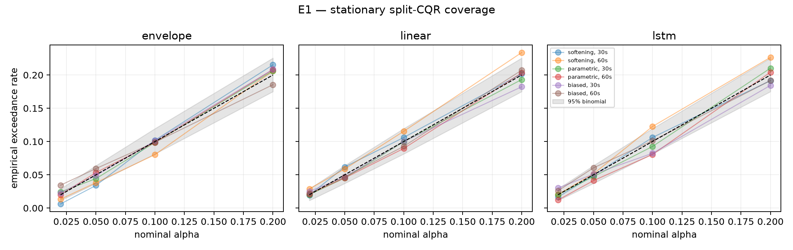
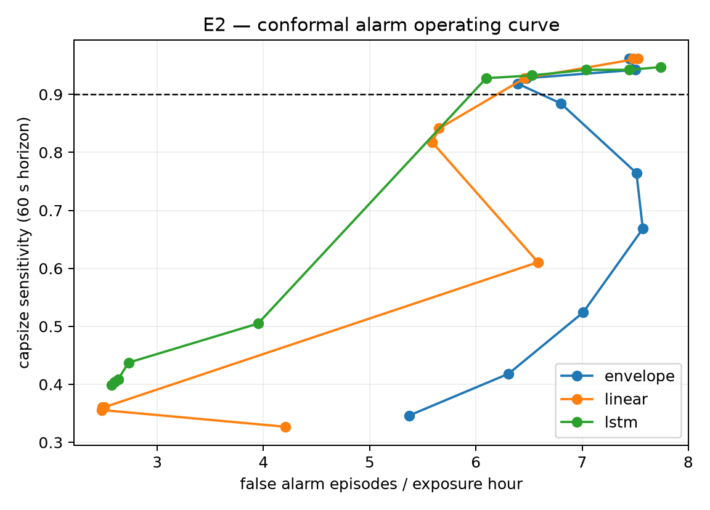
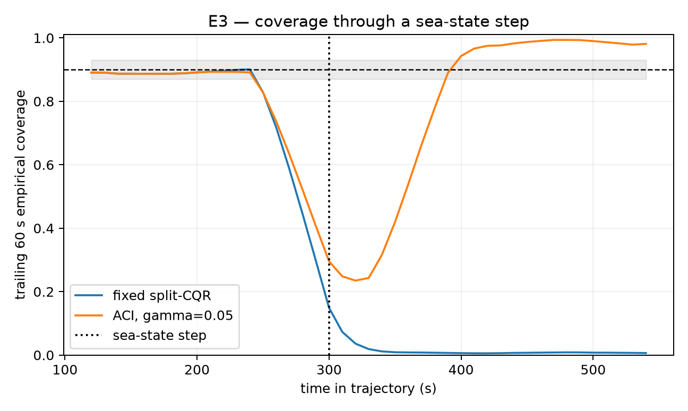
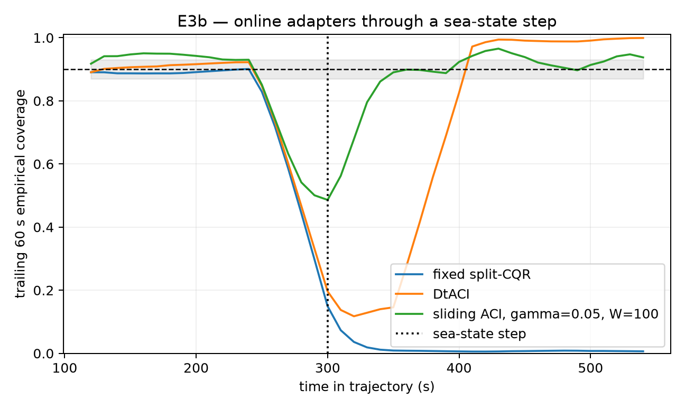
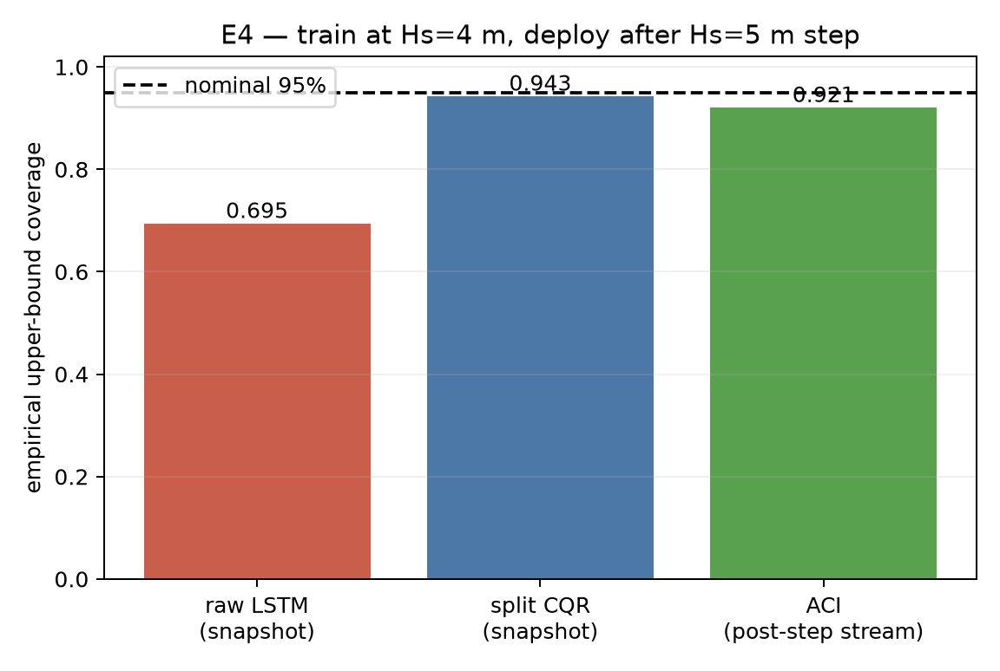
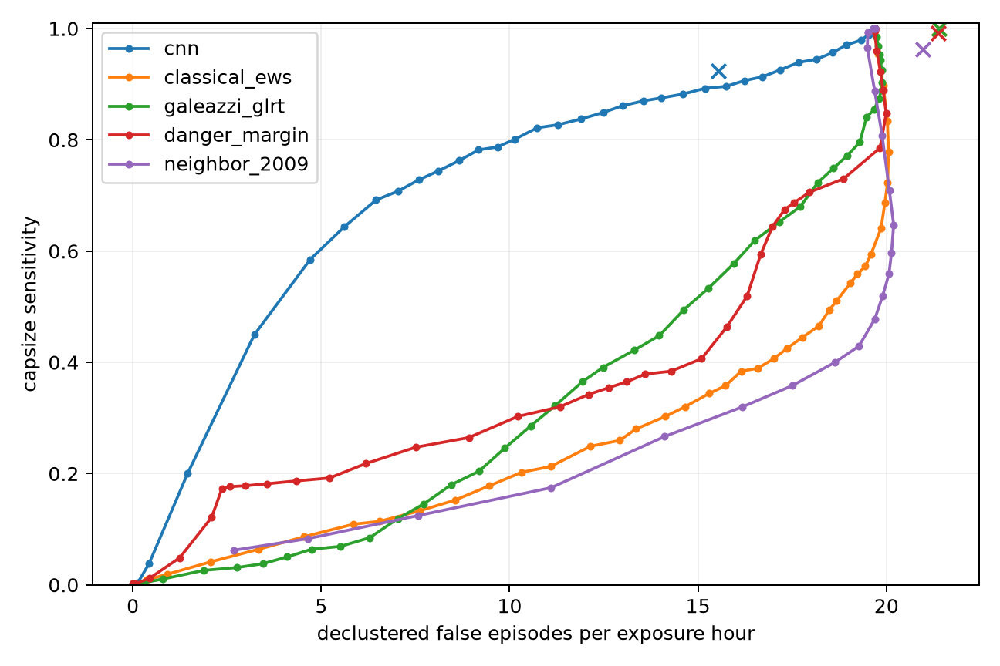
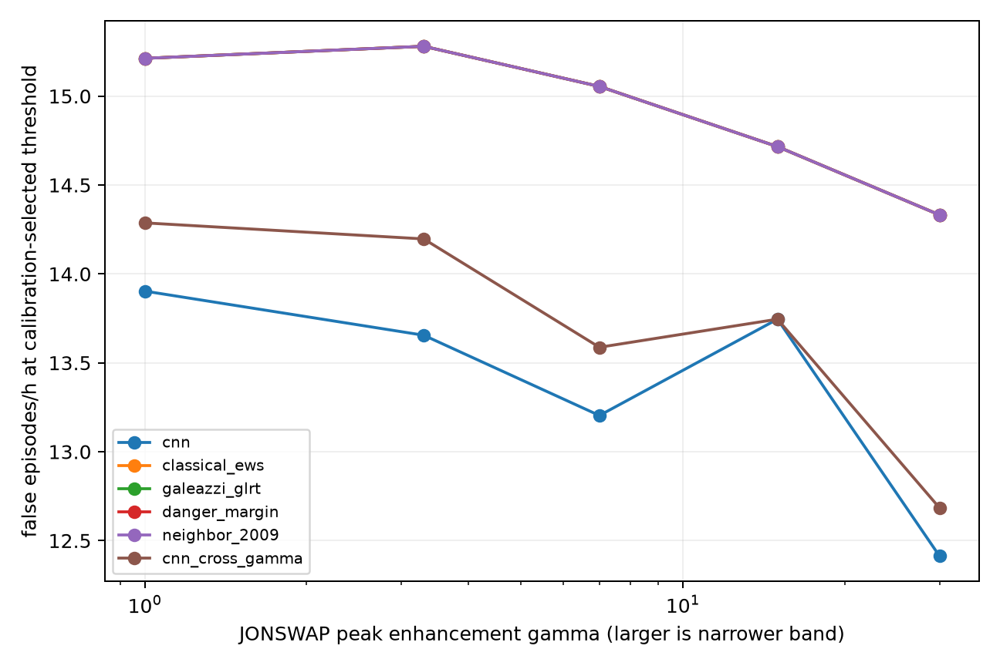
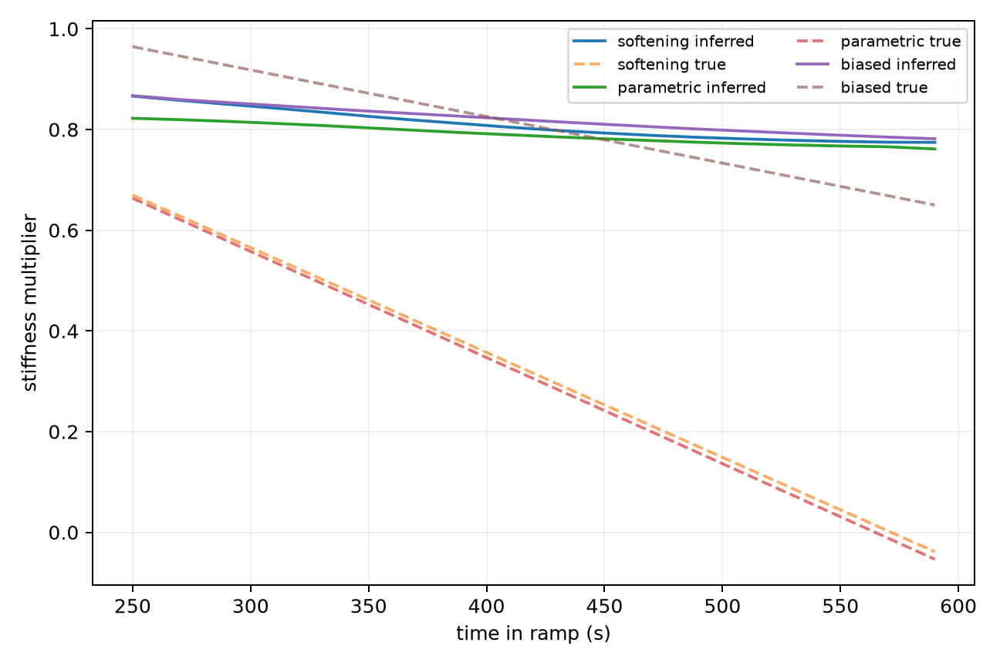

# Prototype #1 results — conformal and physics alarm layers

The JSON files under `results/` are the numeric record; PNG files are the figures. Unless stated
otherwise, brackets are two-sided 95% Clopper–Pearson intervals computed by the shared evaluation
harness. Sensitivity trials are capsize events in the detector's explicit debounce-and-horizon risk
set. False-episode intervals treat scorable
windows as alarm-opening opportunities, then rescale the probability interval by opportunities per
exposure hour. Debounce and refractory logic decluster episodes, but residual serial dependence
remains; full decorrelation-time intervals are deferred to Prototype #2.

Per-time E3/E3b coverage is computed over the surviving, non-capsized population. This conditioning
and the dependence among dense windows are not covered by marginal conformal guarantees, so their
narrow window-level intervals should not be read as trajectory-independent uncertainty.

## Post-audit methodology correction

An August 2026 audit found that the detector experiments had selected their nominal matched-
sensitivity operating points on the test curves. That made the reported test thresholds
retrospective. It also found inconsistent treatment of right-censored score windows and capsize
events that occurred before the common three-window debounce could possibly open an alarm.

The development experiments below were rerun after three corrections: controls and thresholds are
selected on calibration only and then frozen; supervised negatives require a complete forecast
horizon; and sensitivity includes only events for which the detector had enough scored endpoints
to open an alarm and at least one endpoint in the warning horizon. Test sensitivity can therefore
fall below the 90% calibration target. The two previously spent reserve evaluations were not rerun.
Their tables are retained as immutable historical records, but they do not validate the corrected
operating-point protocol.

Each regenerated development JSON carries SHA-256 fingerprints of the research source tree, the
tracked reference-campaign anchor, and its own serialized content. Downstream runners bind exact
upstream artifact digests, so the tables below cannot silently combine stale or mutated results.

## E1 — stationary coverage

Across 72 cells (three families, two horizons, three forecasters and four alpha values), mean
absolute coverage error was a descriptive **0.75 percentage points**. The worst cell was the linear
forecaster on the 60-second softening target at nominal 80%: coverage was **76.62% [73.83, 79.25]**,
a **−3.38-point delta [−6.17, −0.75]**. Exact intervals for every cell are in the JSON and the figure
retains binomial acceptance bands. This validates the implementation broadly but does not turn
marginal coverage into conditional or survivor-conditioned coverage.



## E2 — alarm operating cost and the physics floor

Controls were selected at the lowest calibration FPR attaining at least 90% sensitivity and then
evaluated once, unchanged, on the pooled 15,000-trajectory rare-event test set (60-second horizon):

| Method | Control | Sensitivity | False episodes / exposure h | Median lead |
|---|---:|---:|---:|---:|
| Envelope persistence | alpha=0.010 | 95.5% [91.63, 97.92] | 7.304 [7.179, 7.431] | 172.4 s |
| Linear quantile | alpha=0.020 | 85.0% [79.28, 89.65] | **6.383 [6.265, 6.502]** | 236.9 s |
| 4.6k-parameter JAX LSTM | alpha=0.020 | 96.5% [92.92, 98.58] | 6.963 [6.840, 7.087] | 179.5 s |
| Split-time danger margin | threshold=−1.10 rad/s | 82.0% [75.96, 87.06] | 8.228 [8.095, 8.362] | 137.9 s |

The danger-margin baseline fits a three-range local piecewise-linear restoring model separately on
each side: translate to the stable equilibrium, match its slope and the first smooth-restoring peak,
then force the repeller branch to vanish at the configured escape angle. The resulting repeller
slope enters Belenky et al.'s damped critical-rate formula (Eq. 13). At arbitrary scoring instants we
use the nearer intermediate threshold and extrapolate the separatrix line; the alarm score is
measured outward rate minus critical rate. Eq. 15's particular-solution correction is implemented,
but it is zero in E2 because wave-field inputs are prohibited.

The linear and danger-margin controls met the target on calibration but missed it on test; they are
not valid matched-sensitivity comparisons there. This quantity was developed as an offline
rare-event extrapolation metric. Our documented search
found no prior use as a continuously evaluated online alarm score; that novelty claim is therefore
provisional, not proof of absence. Here it is a useful physics floor, but at the ≥90% operating point
the fixed danger-margin control fails to retain 90% test sensitivity, so the earlier matched-cost
claim is withdrawn.

Exposure begins when a complete 120-second history makes the trajectory scorable. Every episode
overlapping a pre-capsize horizon is event-associated, so repeated alarms inside the horizon are not
charged as false. Exposure ends at the last horizon-complete scored endpoint, not at the later raw
record boundary. Lead time begins when the debounce-confirming window opens the earliest associated
episode and can exceed 60 seconds. The figure contains calibration curves plus the single frozen
test point for each method; test labels
were not used to publish or choose a test-set curve.



## E3 — scalar ACI through the sea-state transition

Nominal coverage was 90%. Correctly restricting “pre-step” to horizon-complete windows ending no
later than 240 seconds, fixed CQR covered **89.37% [89.06, 89.68]**. Windows ending at 250–290
seconds already contain post-step targets and covered only **17.68% [17.07, 18.30]**. Fixed CQR's
pooled post-step coverage was **0.74% [0.68, 0.81]**.

The calibration-selected scalar ACI setting remained gamma=0.05. With prediction outcomes fed back
only after the 60-second target is observable (six scoring steps), it covered **88.93%
[88.61, 89.24]** on horizon-complete pre-step windows and **82.44% [82.14, 82.74]** post-step, but
never held the trailing-60-second curve inside ±3 points. It produced **6.130 [5.861, 6.408]** false
episodes/hour versus **0 [0, 0.012]** for fixed CQR.

The frozen kill criterion therefore still triggers. This is a rolling/conditional demand;
Gibbs–Candès Proposition 4.1 guarantees long-run average error frequency, not rolling-window
coverage. The figure's large-gamma sawtooth is the scalar ACI limit cycle: a frozen score set drives
the working alpha into exterior levels to inflate bounds, which also inflates alarm episodes. The
precise finding is: **scalar ACI over a frozen score set cannot track this abrupt shift at the frozen
operational alarm cost**. It is not an indictment of every online adapter.



## E3b — DtACI and sliding score recalibration

E3b retained the same test bed and kill thresholds. Deterministic DtACI uses Gibbs and Candès'
published eight-expert gamma grid and target interval 500. Sliding ACI was selected only on the held
out calibration half from gamma `{0.001, 0.005, 0.01, 0.02, 0.05}` and score windows `{25, 50, 100}`;
the selected pair was gamma=0.05, window=25. Both adapters receive each outcome only after the
60-second forecast target becomes observable.

| Adapter | Post-step coverage | Recovery to ±3 points | False episodes / h | Verdict |
|---|---:|---:|---:|---|
| DtACI | 67.22% [66.85, 67.59] | not attained | 6.076 [5.808, 6.352] | kill |
| Sliding-score ACI | 87.18% [86.92, 87.44] | not attained | 5.863 [5.600, 6.134] | kill |

With realistic delayed feedback, recent-score recalibration no longer repairs the rolling-coverage
criterion, and neither successor stays under the predeclared alarm-cost threshold. Sliding
recalibration is explicitly nonexchangeable and does not inherit ordinary
split-conformal coverage; its motivation is recent weighting under distribution drift, not a claim
of exact exchangeable validity.



## E4 — cross-sea-state stress test

Training at Hs=4 m and deploying after the Hs=5 m step dropped raw nominal-95% LSTM snapshot
coverage to **69.48% [67.75, 71.17]**, a **25.52-point shortfall [23.83, 27.25]**. Deployment-
distribution calibration restored split-CQR snapshot coverage to **94.34% [93.43, 95.17]**, a
**−0.66-point delta [−1.57, 0.17]**. On dense post-step windows, fixed CQR covered **93.64%**
and delayed-feedback ACI covered **92.12%**.



# Prototype #2 results — deep motion-history warning

Prototype #2 uses 60-period, causally normalized roll/roll-rate windows, a 50-period event horizon,
the same three-window debounce/refractory policy for every method, and score-specific decorrelation
times estimated from calibration autocorrelation envelopes. Brackets remain 95% Clopper–Pearson
intervals. The numeric JSON is authoritative where a compact table omits secondary methods.
Operational score streams retain every causal pre-capsize endpoint so debounce has no
future-dependent gaps. Supervised comparisons, event risk sets, and exposure use the same final
horizon-complete endpoint for capsizing and noncapsizing records; later scores are inference-only.

The following criteria were frozen in `rahola_lab.constants` before development-test scoring:

1. Stop CNN iteration after the two-model grid if it cannot beat classical EWS when both retain the
   calibration-targeted ≥90% sensitivity in D1.
2. Apply the D3 bandwidth interpretation verbatim, whichever branch the data select.
3. Call the CNN an overall win only if it beats the danger-margin physics floor in D1 and is at
   least 10% lower-FPR than B1 in every held-out-family D2 rotation.

## D1 — within-distribution skill

The corrected 2,969-parameter CNN uses 12/24 channels, kernel 9, with no auxiliary family head.
Calibration selected variance trend over a 50%-window subwindow and neighbor radius 0.20. Each
method's threshold was selected on calibration and frozen before test scoring.

| Detector | Sensitivity | False episodes / exposure h | Lead q10 / median / q90 |
|---|---:|---:|---:|
| Temporal CNN | 92.36% [90.49, 93.97] | **15.548 [15.280, 15.819]** | 218.8 / 326.4 / 329.5 s |
| Classical EWS (variance trend) | 100% [99.61, 100] | 21.391 [21.079, 21.705] | 234.9 / 328.4 / 329.8 s |
| Galeazzi roll-power GLRT | 100% [99.61, 100] | 21.391 [21.079, 21.705] | 234.9 / 328.4 / 329.8 s |
| Split-time danger margin | 99.16% [98.36, 99.64] | 21.368 [21.057, 21.682] | 237.9 / 328.4 / 329.8 s |
| Story (2009) neighbor loss | 96.34% [94.94, 97.44] | 20.959 [20.651, 21.271] | 228.5 / 328.4 / 329.8 s |

The CNN preserves the calibration target on test and has the lowest false-episode rate. Its 27.3%
lower FPR/h than classical EWS comes with lower sensitivity (92.36% versus 100%); the
calibration-only operating-point comparison is a corrected development result, not prospective
holdout validation.



## D2 — family generalization

| Held-out family | CNN sensitivity | CNN FPR/h | B1 sensitivity | B1 FPR/h | CNN ≥10% better? |
|---|---:|---:|---:|---:|---:|
| Softening | 64.53% [60.01, 68.87] | 20.528 [20.000, 21.066] | 100% [99.21, 100] | 20.828 [20.296, 21.369] | No: CNN misses sensitivity |
| Parametric | 88.33% [83.58, 92.11] | 11.764 [11.361, 12.177] | 100% [98.47, 100] | 21.685 [21.145, 22.236] | No: CNN misses sensitivity |
| Biased | 76.21% [70.41, 81.37] | 3.533 [3.311, 3.766] | 100% [98.52, 100] | 21.657 [21.115, 22.208] | No: CNN misses sensitivity |

Each rotation selects every model and baseline control using only the two included families'
calibration split. After those controls and thresholds are frozen, the CNN misses 90% test
sensitivity in every held-out family. Its lower FPR in parametric and biased therefore cannot be
claimed as a matched operating-cost win. The model does not earn an all-family transferable
operating point. The full five-detector rotation
table, including calibration points and exact intervals, is in the JSON.

## D3 — skill versus forcing bandwidth

Severity was separately tuned to a 20–60% capsize band at every γ. JONSWAP γ=1 is the broadband
end; γ=15 and 30 are deliberately non-oceanographic narrow-band controls.

| γ | CNN sensitivity | CNN FPR/h [95% CI] | CNN AUC | B1 FPR/h [95% CI] | B1 AUC |
|---:|---:|---:|---:|---:|---:|
| 1.0 | 93.87% [90.68, 96.21] | **13.903 [12.846, 15.022]** | 0.920 | 15.213 [14.107, 16.378] | 0.350 |
| 3.3 | 87.62% [83.52, 91.00] | **13.655 [12.607, 14.765]** | 0.891 | 15.280 [14.173, 16.448] | 0.441 |
| 7.0 | 88.89% [85.01, 92.06] | **13.204 [12.173, 14.296]** | 0.871 | 15.055 [13.955, 16.215] | 0.468 |
| 15.0 | 93.97% [90.92, 96.23] | **13.745 [12.694, 14.858]** | 0.879 | 14.716 [13.629, 15.864] | 0.486 |
| 30.0 | 87.67% [83.85, 90.86] | **12.414 [11.414, 13.476]** | 0.862 | 14.332 [13.259, 15.467] | 0.534 |

The calibration-fixed EWS operating point is always-on through γ=15 and nearly always-on at γ=30;
its AUC carries the ranking story. The other baselines show related failures in the full JSON. Trend
statistics saturate because everything trends on a ramp; the danger margin's static restoring fit
goes stale as stiffness erodes; and causal normalization rescales growing amplitude away, erasing
the neighbor detector's novelty signal.

The CNN retains strong window ranking at every bandwidth, but it does not earn the predeclared
broadband operating-cost criterion: at γ=1 its 13.903 FPR/h is only 8.6% below EWS, short of the
10% materiality threshold. The two original verdict predicates were not complements, so the stored
verdict now takes an explicit inconclusive branch: ranking survives, but neither the material
operating-cost claim nor broadband collapse is established.



## D4 — wave-group stratification

A critical group is an evaluator-only run with instantaneous wave-height proxy
`2 × |Hilbert(elevation)| ≥ 0.75 Hs` for at least 1.5 peak periods. A capsize is group-preceded when
such a run overlaps its 200-second warning horizon. Across the unfiltered campaign record this
labels 1,202/1,241 capsizes, 96.86% [95.73, 97.76%]; the detector table then applies the corrected
common risk set. No forcing value enters a detector.

| Detector | Sensitivity: group (median lead) | Sensitivity: no group (median lead) | False episodes coincident with noncapsizing group |
|---|---:|---:|---:|
| CNN | 92.21% [90.29, 93.85] (326.3 s) | 96.88% [83.78, 99.92] (327.9 s) | 75.38% [74.61, 76.14] |
| Classical EWS | 100% [99.60, 100] (328.4 s) | 100% [89.11, 100] (328.6 s) | 88.40% [87.91, 88.88] |
| Galeazzi GLRT | 100% [99.60, 100] (328.4 s) | 100% [89.11, 100] (328.6 s) | 88.40% [87.91, 88.88] |
| Danger margin | 99.13% [98.30, 99.63] (328.4 s) | 100% [89.11, 100] (328.4 s) | 85.44% [84.90, 85.97] |
| Neighbor loss | 96.54% [95.15, 97.62] (328.4 s) | 90.63% [74.98, 98.02] (328.7 s) | 85.90% [85.36, 86.43] |

The corrected common risk set contains 924 group-preceded and only 32 non-group capsizes, hence
the wide latter intervals. Coincidence is tested against the actual alarm intervals within each
decorrelation-merged cluster, beginning only at the debounce-confirming window; quiet gaps inside a
cluster and the preceding candidate windows do not count as active alarms. Between 75% and 88% of
episodes charged as false coincide with a
noncapsizing critical-group encounter. This is a descriptive overlap only: groups are common, and
without a prevalence-matched null or encounter-identification test the coincidence does not show
that a detector identified the group or that the episode was operationally useful.

## D5 — within-regime discrimination

| Detector | Post-step window AUC | Fixed test sensitivity | Fixed test FPR/h [95% CI] |
|---|---:|---:|---:|
| CNN | 0.474 | 90.69% [88.73, 92.40] | **22.777 [21.747, 23.841]** |
| Classical EWS | 0.509 | 93.04% [91.30, 94.52] | 23.860 [22.806, 24.946] |
| Galeazzi GLRT | 0.493 | 90.98% [89.05, 92.67] | 23.041 [22.005, 24.110] |
| Danger margin | 0.499 | 91.67% [89.80, 93.29] | 23.411 [22.367, 24.488] |
| Neighbor loss | 0.498 | 91.08% [89.16, 92.76] | 23.675 [22.625, 24.757] |

No method discriminates imminent capsize well inside the harsh post-step regime. All methods can
attain the calibration target after impossible-to-observe events are removed from supervised model
fitting; operational score streams themselves remain causal and unfiltered by future outcomes. The
near-chance AUCs remain the substantive D5 result; achieving sensitivity requires alarm rates around
23–24 episodes/hour.

## Historical final reserve evaluation (immutable; superseded method)

The following is the original one-touch record. Its thresholds were chosen with the former
test-curve procedure and its risk sets predate the censoring correction. It is retained for audit
history and was not rerun; it is not a validation of the corrected development results above.

The guarded command accessed the reserve exactly once on frozen commit
`843b24a25437c5386208bc66ee0b79776ad207dc`, from 2026-08-03 05:07:08 to 05:09:20 UTC. It scored
18,000 trajectories (the same 5,000-evaluation/1,000-ramp mix per family as D1), yielding 1,213
observable capsizes and 1,781.47 exposure hours. Thresholds, model weights, and decorrelation times
were unchanged from D1.

| Detector | Reserve sensitivity | Reserve false episodes / h | Lead q10 / median / q90 |
|---|---:|---:|---:|
| Temporal CNN | 89.78% [87.93, 91.43] | **6.279 [6.164, 6.395]** | 277.8 / 328.6 / 358.4 s |
| Classical EWS | 91.67% [89.97, 93.17] | 9.232 [9.093, 9.372] | 197.3 / 357.9 / 360.1 s |
| Galeazzi roll-power GLRT | 89.53% [87.67, 91.20] | 8.295 [8.163, 8.428] | 171.3 / 309.3 / 358.5 s |
| Split-time danger margin | 94.72% [93.31, 95.91] | 9.103 [8.965, 9.242] | 29.3 / 329.4 / 359.8 s |
| Story (2009) neighbor loss | 98.35% [97.46, 98.99] | 9.306 [9.166, 9.447] | 273.3 / 358.8 / 360.3 s |

The CNN's FPR replicated D1 to within 0.01 episode/h, while sensitivity fell 0.69 points and just
missed 90%. This does not trigger model iteration: the final protocol prohibits retuning and reruns.
The completed, no-prior-access statement is in `results/final_reserve_attestation.json`; the command
now refuses a second invocation. This immutable historical attestation predates result-digest
binding.

## What the thesis rematch showed

### Deliberately acausal normalization appendix

On a disjoint held-out half of the calibration trajectories, thesis-style whole-record
normalization gives the neighbor detector **AUC 0.385** (3,066 windows; radius selected on the other
half). This diagnostic is deliberately acausal and is not an operational result. Here, restoring
the future-dependent normalization does not recover warning skill; it reverses the intended novelty
ranking, so strict causal hygiene is not what made the detector uncompetitive.

The 2009 neighbor-loss idea is sensitive but indiscriminate here. Its calibration-selected D1 point
catches 96.34% of risk-set capsizes, yet costs 20.959 false episodes/h, versus 15.548 for the CNN and
21.368 for the physics floor. It also has only 0.498 within-regime AUC and 89.99% of its nominally
false D1 episodes overlap noncapsizing critical wave groups. That overlap is descriptive and lacks
a prevalence-matched null. The core observation—new
phase-space regions precede extreme motion—survives, but neighbor count alone is not a competitive
alarm policy under a common operating-cost harness.

## Prototype #2 implementation judgments and deviations

- Story's Chapter 3 normalized each complete roll/pitch record by its mean and standard deviation,
  which uses future data. Rahola instead applies strict prior-only normalization to roll/rate. It
  replaces pitch with roll rate because the simulator is 1-DOF (Story 2009, Sec. 3.2.2, pp. 48–52,
  Figs. 38–41; Sec. 4.2.2, pp. 64–66).
- Chapter 3 set the binary warning at fewer than 50 neighbors and accumulated one flag per low-count
  sample. Rahola preserves score `−neighbor_count` and includes threshold −50 in the curve, but
  resolves persistence through the common three-window episode policy. Calibration selected radius
  0.20; one natural period is excluded so adjacent samples cannot count themselves.
- Chapter 4 searched the full history only on newly encountered roll regions, then reused the prior
  count. Rahola searches the exact trailing 60-period normalized phase plane at every score time;
  this preserves the novelty meaning but replaces the thesis's computational cache and pooled
  cross-run historical database. The thesis itself reports abandoning its real-time cumulative flag
  after corrupted output (Story 2009, pp. 65–67, Fig. 51).
- Galeazzi's W2-GLRT uses the transformed roll/pitch signal `d=roll²×pitch`. With no pitch and no
  permitted wave input, B2 applies the published fixed-shape scale-change likelihood ratio to
  natural-frequency-band roll, retaining the four-roll-period detection segment. It is a documented
  roll-power adaptation, not a literal reproduction of the multichannel statistic.
- B3 takes the dimensional roll/rate endpoint from the same causal window rather than its normalized
  representation; the closed-form danger margin requires physical units and remains unchanged.
- D4's 0.75 Hs/1.5 Tp Hilbert-envelope group is a stated run-length proxy inspired by critical wave
  groups, not Anastopoulos and Spyrou's full Markov-chain construction. Hilbert edge effects and the
  broad definition make groups common.
- Decorrelating alarm episodes merges gaps no longer than each calibration score's autocorrelation-
  envelope crossing time, following the Belenky-school convention. Clopper–Pearson FPR intervals
  still use scorable windows as the binomial opportunity convention; declustering reduces repeated
  episodes but does not make dense windows independent.
- Development test blocks were rerun while correcting the explicit thesis curve point and D4 risk-
  set denominator. The August audit later found that operating thresholds had nevertheless been
  selected from test curves; the corrected protocol and historical reserve limitation are recorded
  above.

# Prototype #3 results — restart comparisons and architectures

## What the restart comparison said

The corrected run used 16,000 test windows: 2,000 per campaign from the three stationary
evaluation campaigns, three ramps, and softening γ=1/3.3. Sampling uses capped-equal allocation
across each nonempty label × absolute-time-quartile stratum: small strata are exhausted and their
unused quota is redistributed. The AUC estimand is therefore a realized-sample design contrast,
not an exactly balanced population estimand.
Every method scored identical windows and labels. Confidence intervals use a 2,000-replicate
trajectory-block bootstrap.

These intervals condition on both the realized stratified sample and the realized restart draws.
They do not add uncertainty stages for unequal-probability sampling or rollout Monte Carlo error,
so they are neither design-based survey-sampling intervals nor full simulation-uncertainty bounds.

| Method | Design-balanced AUC [95% CI] |
|---|---:|
| C1 exact-state, independent-future restart | **0.8512 [0.8351, 0.8680]** |
| C2 filtered-state, independent-future restart | 0.4855 [0.4603, 0.5144] |
| Frozen D1 CNN | 0.6265 [0.5959, 0.6631] |
| B0 XGBoost engineered features | 0.7622 [0.7438, 0.7811] |
| Clock-only protocol quartile | 0.6565 [0.6436, 0.6706] |

No information-ceiling gate is valid. C1 and C2 draw fresh stochastic forcing and discard the
realized forcing phase encoded in the preceding motion history. C1 therefore need not upper-bound
a sequence model observing that history. The historical three-point gap trigger would open because
C1−CNN is 0.2246, but it is recorded only as the architecture decision that was made at the time,
not as proof of architecture headroom or an information limit.

The clock-only comparator exceeds both the CNN and C2 on this sampled estimand. Absolute protocol
time is therefore a material confound: the table cannot isolate motion/state information from the
campaign schedule, and CNN/C2 rankings must not be attributed to motion history alone.

C1 knows exact endpoint roll/rate, true current stiffness, deterministic remaining ramp, family,
and sea-state specification. C2 is a known-family, Rao–Blackwellized bootstrap filter: exact
observed roll/rate are pinned while 2,000 particles infer stiffness and linear drift under a robust
encounter-innovation likelihood. The optional family-marginalized PF was not run. C1−C2 is 0.3657,
C2−CNN is −0.1410, and C1−CNN is 0.2246, but these are restart-comparator gaps rather than a
clean decomposition of state-estimation and model-capacity error.

Probability calibration is reported separately with post-stratum weights that reconstruct the
source-window population. C1's weighted Brier score is 0.00721 and weighted ten-bin ECE is 0.00078;
those numbers are not calibration of the capped-equal AUC sample. The final regenerated program took
1,950.5 seconds (32.5 minutes), below the two-hour budget, with 200 restarts per window and no
coverage reduction.

## B1 — amortized physical filter

The selected 4,329-parameter gray-box uses a temporal encoder, Gaussian physical-latent head, and
split-time-inspired outward-rate margin hazard. Auxiliary weight 0.25 beat 1.0 on calibration.

| Test | Gray-box FPR/h | CNN FPR/h | Relative change |
|---|---:|---:|---:|
| D1 pooled | 17.471 [17.188, 17.757] | 15.548 [15.280, 15.819] | 12.4% worse |
| D2 held-out softening | 18.615 [18.111, 19.130] | 20.528 [20.000, 21.066] | 9.3% lower; sensitivity 10.9% |
| D2 held-out parametric | 11.265 [10.871, 11.670] | 11.764 [11.361, 12.177] | 4.2% lower; sensitivity 87.9% |
| D2 held-out biased | 5.124 [4.856, 5.402] | 3.533 [3.311, 3.766] | 45.0% worse; sensitivity 77.0% |

One required kill fires after calibration-only threshold selection. The other two verbatim gates
are not evaluable without conditioning on test outcomes or survival:

- **“Kill: fails to beat the from-scratch CNN's D2 FPR/h by >=15% in at least two of three
  rotations.”** B1 earned 0/3.
- **“Kill: worse than the CNN by more than its CI width at matched sensitivity.”** Not evaluated.
  D1 gray-box FPR/h is 17.471 versus 15.548 for the CNN, but their frozen test sensitivities differ;
  matching them on test would reopen test-label selection. The former 16.086 comparison remains a
  calibration-targeted diagnostic, not the verbatim kill.
- **“Kill: mean absolute stiffness error exceeds 10% over the final third of the ramp.”** Not
  evaluable unconditionally because trajectories capsizing before the final third have no such
  outcome. The survivor-conditioned, trajectory-weighted diagnostic MAE is 0.420 across 1,996
  trajectories and exceeds the 0.10 limit.



## B2 — Chronos transfer probe

The probe pins `amazon/chronos-t5-tiny` revision
`29d808298f1a62493e7b9a5e08529d0d930fa189` (8.39M parameters, Apache-2.0) and tries exactly two
modes: frozen encoder embeddings with a linear head, and a one-epoch full-encoder fine-tune with a
head. CPU cost forced an explicit 128-trajectory-per-campaign subset; all B2 test comparators use
those same trajectories. Fine-tuning is capped at 1,024 class-weighted windows. The artifact records
the actual samples per rotation: 97–116 positives and 908–927 negatives; these are not described as
balanced.

| Held-out family | From-scratch CNN: sens; FPR/h | Chronos frozen: sens; FPR/h | Chronos fine-tuned: sens; FPR/h | Twenty-capsize CNN: sens; FPR/h |
|---|---:|---:|---:|---:|
| softening | 100%; **17.113 [14.836, 19.626]** | 92.3%; 18.083 [15.743, 20.658] | 90.4%; 18.259 [15.908, 20.845] | 100%; 16.583 [14.342, 19.063] |
| parametric | 100%; 12.960 [10.979, 15.185] | 100%; **10.844 [9.035, 12.901]** | 100%; 20.190 [17.720, 22.892] | 100%; 11.197 [9.358, 13.283] |
| biased | 86.2%; **9.588 [7.883, 11.543]** | 96.6%; 18.376 [16.010, 20.978] | 96.6%; 20.152 [17.676, 22.861] | 86.2%; 8.966 [7.319, 10.865] |

The B2 kill does **not** fire: frozen Chronos qualifies on held-out parametric with 16.3% lower
FPR/h while both methods detect every evaluable event. Softening Chronos is worse, and the biased
from-scratch CNN misses the sensitivity target, so those rotations do not qualify. The corrected
development probe therefore has one qualifying rotation and a development survivor. This
cannot alter or retrospectively validate the already-spent reserve-2 evaluation.
The Twenty-Capsize protocol used all normal trajectories from the target stationary training
campaign plus exactly 20 target capsizes and earns no additional transfer result.

D5 remains the negative control: frozen-embedding AUC is 0.500 and fine-tuned AUC is 0.570 after
right-censored tails and the ambiguity buffer are removed. Their orientation-independent AUCs are
0.500 and 0.570, respectively, so neither crosses the 0.58 leakage-audit trigger.

## Historical final reserve-2 evaluation (immutable; invalid operating-point selection)

This one-touch result is retained exactly as produced, but the audit found that Chronos selected
its threshold by sweeping reserve-2 outcomes. The 50.5% FPR reduction below is descriptive, not a
prospective operating-policy validation. Reserve-2 is spent and was not rerun.

B2's survivor triggered the guarded run exactly once on commit
`5d4c6be78ba87e1a042f99825909c37d38bbd702`, from 2026-08-03 15:41:53 to 15:48:14 UTC. The
holdout contains 128 trajectories from each of the six D1-mirroring campaigns: 768 trajectories,
129 observable capsizes, and 76.25 exposure hours. Every method below uses that same holdout.

| Detector | Sensitivity [95% CI] | False episodes/h [95% CI] | Lead q10 / median / q90 |
|---|---:|---:|---:|
| Chronos frozen embedding | 93.80% [88.15, 97.28] | **3.292 [2.899, 3.723]** | 45.6 / 129.5 / 357.8 s |
| Chronos fine-tuned | 91.47% [85.25, 95.67] | 7.134 [6.553, 7.753] | 178.6 / 299.3 / 359.7 s |
| Frozen D1 CNN | 97.67% [93.35, 99.52] | 6.649 [6.088, 7.248] | 280.1 / 330.1 / 357.8 s |
| Split-time physics floor | 97.67% [93.35, 99.52] | 7.882 [7.270, 8.530] | 29.4 / 339.9 / 359.9 s |

Under the invalid retrospective threshold choice, the frozen Chronos embedding head has 50.5%
lower FPR/h than the CNN, with sensitivity 3.9 points lower. That cannot support the former claim
that it replicated as the operational winner. Fine-tuning is worse than the CNN on pooled
reserve-2. The completed attestation is
`results/final_reserve2_attestation.json`; repository-local guards refuse a repeat under the stated
procedure. This immutable historical attestation also predates result-digest binding.

## Prototype #3 implementation judgments and deviations

- The restart API accepts per-trajectory roll, rate, current stiffness, stiffness drift, and
  deterministic-parametric phase offset. Independent restart variance differs from a corresponding
  full-run segment by 3.1%, inside the predeclared 15%; capsize fraction differs by zero points.
  That direct equivalence test covers stationary softening only; parametric, biased, and ramped
  restart equivalence remain unvalidated.
- C2 pins essentially noise-free synthetic roll/rate observations and filters only stiffness and
  drift. It assimilates every two seconds so band-limited forcing innovations are not treated as
  independent samples. No family-marginalized variant was run.
- B0 is XGBoost 3.3.0 with a fixed 200-tree, depth-3 configuration. Its features are variance, AC1,
  two Kendall trends, envelope summaries, period, danger margin, neighbor count, GLRT, and endpoint
  magnitudes.
- B1's “posterior” is a diagonal Gaussian latent head; its analytic hazard uses the posterior mean.
  This is an amortized approximation, not the 2,000-particle C2 posterior or an MC physics rollout.
- B2 uses univariate Chronos passes for roll and roll-rate, concatenating their encoder summaries.
  The CPU subsample is a declared deviation from full D2 coverage. B1 values shown beside B2 in the
  JSON use full D2 and are therefore contextual, not exact paired-subset comparisons.
- Historical B1 attempts exposed empty pre-window trajectories and non-finite sentinel thresholds.
  The audit removed synthetic sentinel observations entirely; empty score streams are now valid and
  every operational threshold is finite.

## Relation to prior work

Our documented search found no conformal-prediction application to motion-based ship-stability or
capsize early warning. Nearby maritime uses concern AIS trajectory and collision regions, including
a recent conformal collision-boundary study. The established motion-based false-alarm benchmark is
Galeazzi et al.'s parametric-roll monitoring: Weibull/phase signal tests, designed false-alarm
discipline, and year-long full-scale validation. Rahola is a ROM-first synthetic step toward adding
distribution-free uncertainty to that operational standard, not a replacement for its sea trials.

The 1-DOF approach follows the field's ROM-first methodology: Belenky et al. explicitly describe
1-DOF models as guides for multiple-DOF numerical methods. The caveat is substantive. Stability
variation in waves and stern-quartering roll/rate dependence require body-nonlinear models with at
least heave, roll, and pitch; this library cannot validate those effects.

## Reproduce

```bash
uv run python examples/e1_coverage.py
uv run python examples/e2_operating_curve.py
uv run python examples/e3_transition.py
uv run python examples/e3b_adapters.py
uv run python examples/e4_stress_test.py
uv run python examples/d1_detectors.py
uv run python examples/d2_family_generalization.py
uv run python examples/d3_bandwidth.py
uv run python examples/d4_wave_groups.py
uv run python examples/d5_within_regime.py
uv run python examples/p3_acausal_neighbor.py
uv run python examples/p3_ceiling.py
uv run python examples/p3_b1_graybox.py
uv run python examples/p3_b2_chronos.py
```

`uv run rahola-lab final-eval` is deliberately absent from the reproducible command list: it is a
one-time protocol, and the completed reserve-2 attestation makes a repeat procedurally forbidden.

## Frozen judgment calls and deviations

- The alarm angle is 0.60× the relevant escape angle; episode debounce and refractory are three
  10-second scoring windows. All episodes overlapping the event horizon are excluded from false
  counts; this recommended choice lowers re-alarming penalties relative to the original E3 report.
- False-episode confidence intervals use scorable windows as binomial opportunities. This satisfies
  the requested common Clopper–Pearson calculation but is only an interval convention under serial
  dependence, which is stated rather than hidden.
- The danger statistic uses the nearer side's threshold and an instantaneous separatrix
  extrapolation between exact upcrossings. The forced correction is zero because E2 is motion-only.
- The initial physics threshold grid ended at −1.0 rad/s and failed to include its analytic always-on
  endpoint. Before final scoring it was extended to −1.75 using fitted config values only; no test
  labels selected the endpoint.
- For asymmetric biased runs, maximum-absolute-roll targets use the smaller escape magnitude in both
  directions. This is conservative but can score a positive excursion against the negative margin.
- DtACI uses deterministic Algorithm 2 rather than randomized Algorithm 1. Sliding ACI tunes only on
  the held-out calibration half and carries no exchangeable finite-sample claim.
- CQR calibration retains one independent snapshot per calibration trajectory. Dense windows are
  operational units, not independent conformal units. Per-time E3 curves also condition on survival.
- Pure JAX is the only neural runtime through Prototype #2. Prototype #3 adds PyTorch solely for the
  pinned Chronos B2 experiment. E2 reports the operational 60-second horizon; E1 covers both frozen
  horizons.
- Provisional earlier work accessed original test splits more than once while correcting risk sets,
  initialization, and threshold provenance. Corrected controls now use calibration only, but the
  literal test-touched-once process rule remains unmet and no fresh-offset holdout remains.

## Method references

- Story, [Predicting Ship Capsize Using Lyapunov Exponents](https://vtechworks.lib.vt.edu/items/7eee36dd-055b-4aec-b49d-b173c2232278),
  Virginia Tech M.S. thesis (2009), especially Secs. 3.2.2, 3.3, and 4.2.2–4.3.
- Dakos et al., [Methods for Detecting Early Warnings of Critical Transitions in Time Series](https://dash.harvard.edu/handle/1/9637972),
  *PLoS ONE* 7 (2012), rolling variance/AC1 and Kendall trend.
- Bury et al., [Deep learning for early warning signals of tipping points](https://pubmed.ncbi.nlm.nih.gov/34544867/),
  *PNAS* 118 (2021), compact sequence-model comparison.
- Galeazzi, Blanke & Poulsen, [Early Detection of Parametric Roll Resonance on Container Ships](https://backend.orbit.dtu.dk/ws/files/7633739/Early_Detection.pdf),
  IEEE CDC (2012), W2-GLRT Eqs. 37 and 42 and the four-period segment.
- Belenky et al., [Estimation of probability of capsizing with split-time method](https://sandlab.mit.edu/wp-content/uploads/24_OEJ.pdf),
  *Ocean Engineering* 292 (2024) 116452, especially Eqs. 11–15 and 26–36.
- Anastopoulos & Spyrou, [Ship dynamic stability assessment based on realistic wave groups](https://doi.org/10.1016/j.oceaneng.2016.10.042),
  *Ocean Engineering* 134 (2017), critical-wave-group motivation.
- Romano, Patterson & Candès, [Conformalized Quantile Regression](https://arxiv.org/abs/1905.03222)
  (2019), one-sided upper-tail Theorem 2.
- Gibbs & Candès, [Adaptive Conformal Inference Under Distribution Shift](https://arxiv.org/abs/2106.00170)
  (2021), equation (2) and Proposition 4.1.
- Gibbs & Candès, [Conformal Inference for Online Prediction with Arbitrary Distribution Shifts](https://jmlr.org/papers/v25/22-1218.html)
  (2024 journal version; 2022 preprint), deterministic DtACI Algorithm 2.
- Foygel Barber et al., [Conformal Prediction Beyond Exchangeability](https://projecteuclid.org/journals/annals-of-statistics/volume-51/issue-2/Conformal-prediction-beyond-exchangeability/10.1214/23-AOS2276.full),
  *Annals of Statistics* 51 (2023), recent weighting under drift.
- Galeazzi et al., [Parametric roll resonance monitoring using signal-based detection](https://orbit.dtu.dk/en/publications/parametric-roll-resonance-monitoring-using-signal-based-detection/),
  *Ocean Engineering* 109 (2015), 355–371.
- Alba et al., [Enhancing Maritime Safety](https://www.mdpi.com/1424-8220/25/5/1365),
  *Sensors* 25 (2025), AIS collision boundaries with conformal prediction regions.
- Ansari et al., [Chronos: Learning the Language of Time Series](https://openreview.net/forum?id=gerNCVqqtR),
  *Transactions on Machine Learning Research* (2024), frozen time-series foundation model.

# Experiment U1 addendum — online split-time rate estimator

## 2026-08-04 predeclarations

These commitments were recorded before any U1 test-block read. Calibration selects one common
configuration by maximizing the number of calibration campaigns whose 95% predicted-count
interval captures the realized count, then minimizing reliability error, then following the
listed grid order. Reliability error is the bin-count-weighted mean absolute difference between
predicted and realized rates. Five calibration-quantile bins define the reliability edges; those
edges remain fixed on test data.

1. The primary intermediate threshold is the fitted, side-specific GZ-maximum angle. A
   campaign-adaptive level targeting 7–10 declustered crossings per 30 minutes appears once as a
   sensitivity analysis.
2. Positive and negative crossings are pooled after normalization by
   `u = outward roll rate / side-specific critical outward roll rate`. Per-side results appear once
   as a diagnostic.
3. Declustering follows Belenky et al. (2024), Section 4.3. The roll-autocorrelation envelope joins
   the absolute local extrema and ends a cluster only when no subsequent crossing lies within one
   decorrelation time of the preceding crossing. The largest `u` in each cluster is retained. The
   envelope threshold is 0.05.
4. Calibration sweeps tail quantile `q` over `{0.50, 0.75}`, Gamma-prior strength `a0` over
   `{2, 5, 10}` pseudo-exceedances, and trailing history over `{full history, 1,800 s, 900 s}`.
   Calibration freezes all controls before test scoring. On records shorter than a candidate
   window, the available causal history is used; candidates that coincide because of record
   length remain separate reported rows. If the empirical quantile reaches or exceeds the critical
   level, `w` is clipped to the largest representable value below 1 and the emission is flagged.
   An emission starts only after its available full causal history contains three tail
   exceedances; earlier exposure contributes zero predicted events.
5. U1a succeeds when 95% predicted-count intervals capture the realized count in at least five of
   the six stationary and rare-event evaluation campaigns.
6. U1c expects the estimated rate to rank vulnerability comparably to the danger margin and to
   remain near chance on D5's geometry. Any D5 AUC above 0.58 triggers a leakage audit, not a
   positive interpretation.
7. The U1d kill fires unless the full decomposition beats both rolling variance and declustered
   upcrossing rate alone on campaign-level CI captures and on the bin-count-weighted mean absolute
   reliability error. If it fires, tuning stops and the negative result stands.
8. With 600-second records and a 300-second step, no fully post-step trailing window of 30 minutes
   exists; U1b reports transient tracking only and makes no established-regime claim. The existing
   900-second `softening_step_v02` campaign will be reported separately for its fully post-step
   segment.
9. The estimator emits every 10 seconds. Its 95% interval uses 512 vectorized parametric-bootstrap
   draws with seed 20,260,804. The bootstrap is recomputed every 60 seconds and carried forward to
   the intervening 10-second emissions. Window statistics use the existing 1,000-replicate,
   campaign-stratified trajectory-block bootstrap with seed 20,260,804.

The primary estimator is a known-configuration method: it observes dimensional roll and roll rate
and uses the configured restoring model, but no wave, encounter, future-forcing, or reserve-block
information. The implementation follows the paper's ROM decomposition and exponential-tail
argument. It does not implement the Motion Perturbation Method from Sections 3.2–3.5, because that
method resimulates future waves and falls outside online operation.
